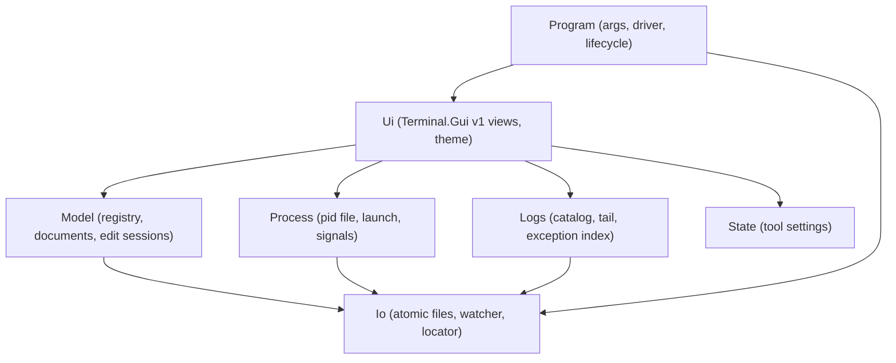
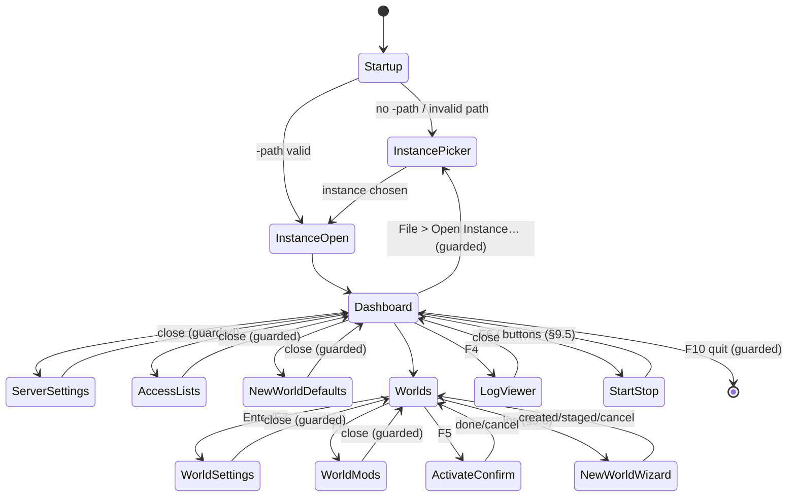
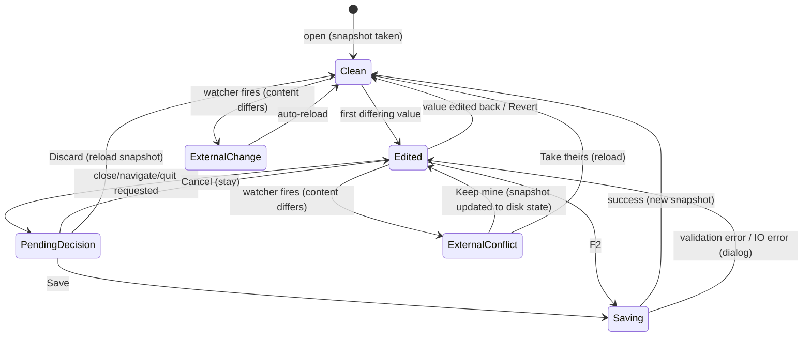
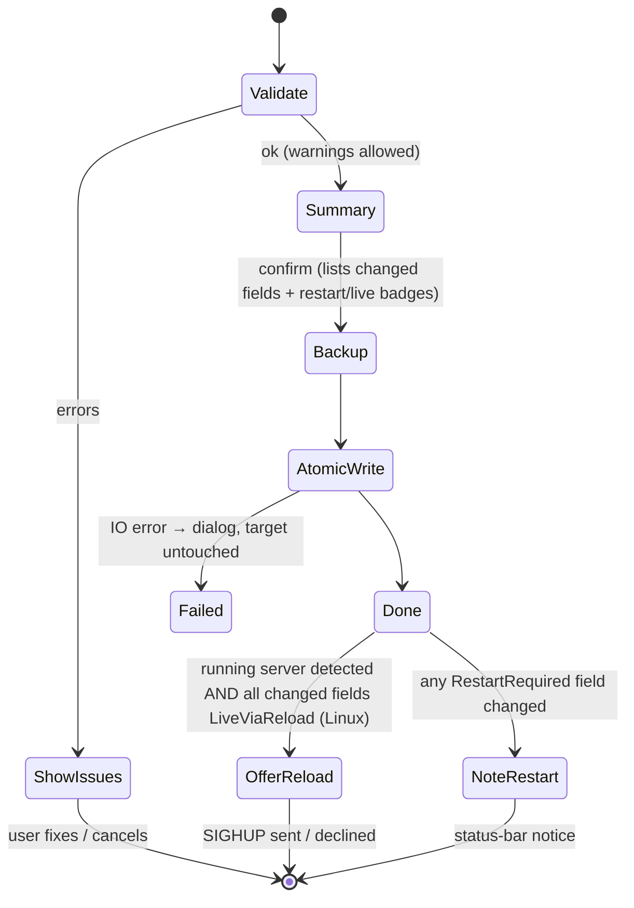
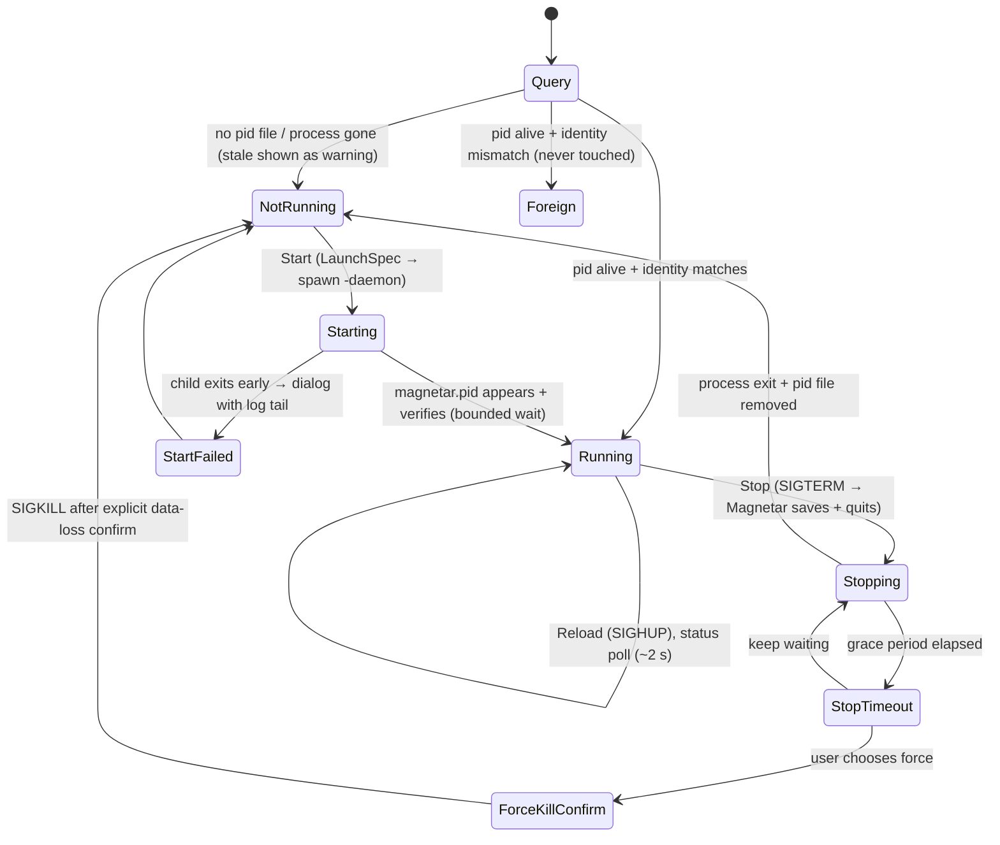

# ConfigTerminal — Terminal UI Configuration Tool for Magnetar

**Status: implemented (initial vertical slice).** The `ConfigTerminal` /
`MagnetarConfig` project and its `ConfigTerminalTests` suite exist and build on
net10.0 (net48 target guarded for Windows). The companion `magnetar.pid` writer
is added to the Legacy launcher. The full **configure-a-new-world → start to
"Game ready" → stop** flow is verified end-to-end against a live DS install +
patched launcher (see `ConfigTerminalTests/LiveEndToEndTests.cs`, gated behind
`MAGNETAR_LIVE=1`). A headless `-diag` mode reports an instance's state (incl. plugins) without
the UI. **Full Magnetar plugin and mod management is implemented** (see below):
separate Plugins views (1) enable/disable **local DLLs** from the instance's
`Local/` folder, (2) add **dev-folder plugins** Quasar-style by picking a manifest
`.xml` (folder + filename + folder-name id derived), (3) **browse hub/remote
plugin catalogs** and enable them (with dependency pull-in), (4) manage the
**plugin sources** (`RemoteHubSources`/`RemotePluginSources`/`LocalHubSources`),
and (5) manage the **mod sources** (`ModSources`), including optional Steam
Workshop name lookup, collection expansion and dependency resolution; a Profiles
view (6) manages **named plugin profiles** (`Profiles/<Key>.xml`) — load, save-new,
update, rename, delete — mirroring Magnetar's own in-game `ProfilesConfig` UI, with
`Current.xml` the active set. All edits go to `Profiles/*.xml` and
`Sources/sources.xml` via the same XDocument-upsert approach; hub catalogs are read
offline from Magnetar's own protobuf caches under `Sources/Hubs`/`Sources/Plugins`
with a minimal wire reader (no `Shared` reference). The last-visited manifest folder and an optional Steam Web API key are
persisted in `ConfigTerminal.xml` (`ToolSettings`). Round-trip compatibility is
verified against Magnetar's own `XmlSerializer` for both `Profile` and
`SourcesConfig` (`ConfigTerminalTests/PluginInteropTests.cs`), the protobuf reader
against a real captured hub cache (`HubCatalogTests`), and the Workshop resolver
against fixtures plus a live Steam API call (`WorkshopResolverTests`,
`WorkshopLiveTests`). Build/packaging is wired: `build.sh`/`build.bat` ship
`MagnetarConfig` in each bundle next to the launcher (§13). Remaining polish
(external-change watcher/conflict flow, incremental search, advanced-fields
toggle) is tracked against §14 phase 6.

A cross-platform console (TUI) application to configure **and operate** a
Space Engineers 1 Dedicated Server instance running under Magnetar: the DS's
global settings (`SpaceEngineers-Dedicated.cfg`), the worlds under the
instance's `Saves/` folder (`Sandbox_config.sbc` session settings and mod
lists), the selection of which world the server loads next
(`LastSession.sbl`), creation of new worlds from the DS's own world templates,
start/stop of the daemonized Magnetar instance bound to the edited
configuration (with PID-file based status), and a built-in log reader for the
game and Magnetar logs.

The tool is scoped to **exactly one Magnetar instance** — the one selected by
the configurable Magnetar config folder and DS data folder pair
([§10](#10-command-line-and-instance-resolution)). It is *not* a fleet
manager: one Magnetar process, running one of the worlds under that `Saves/`
folder at a time, exactly like the original DS would. Multiple instances on
the same machine use separate folder pairs and separate invocations of this
tool.

Built with **[Terminal.Gui v1](https://www.nuget.org/packages/Terminal.Gui)**
(v1 API reference: https://gui-cs.github.io/Terminal.Gui/) in the classic
**Turbo Vision** aesthetic. Developed on Linux first, but designed from day one
to run on Windows as well (both the .NET Framework 4.8 *Legacy* and .NET 10
*Interim* environments).

[Quasar](https://github.com/CometWorks/quasar) is the design reference: its
config-profile mechanism solves the same problem for remotely managed servers
and is battle-tested. We adopt its proven ideas but deliberately do **not**
copy its architecture (see [§3](#3-what-we-take-from-quasar--what-we-do-differently)).

---

## Table of contents

1. [Purpose and scope](#1-purpose-and-scope)
2. [Background: the files being edited](#2-background-the-files-being-edited)
3. [What we take from Quasar / what we do differently](#3-what-we-take-from-quasar--what-we-do-differently)
4. [Architecture and project placement](#4-architecture-and-project-placement)
5. [Data model](#5-data-model)
6. [The option metadata registry](#6-the-option-metadata-registry)
7. [File I/O layer](#7-file-io-layer)
8. [UI design](#8-ui-design)
9. [State machines](#9-state-machines)
10. [Command line and instance resolution](#10-command-line-and-instance-resolution)
11. [Cross-platform notes](#11-cross-platform-notes)
12. [Testing strategy](#12-testing-strategy)
13. [Build, packaging and documentation integration](#13-build-packaging-and-documentation-integration)
14. [Phased implementation plan](#14-phased-implementation-plan)
15. [Risks and open questions](#15-risks-and-open-questions)

---

## 1. Purpose and scope

### In scope

- **Open a DS instance** (the DS data dir selected by `-path`, default per
  platform) and show its current state: server identity, ports, selected
  world, worlds on disk.
- **Edit the DS global config** — every field of `MyConfigDedicatedData`
  (network, identity, MOTD, auto-restart/update, remote API, watchdog,
  anti-spam, access lists, password).
- **Edit the access lists** — `Administrators`, `Banned`, `Reserved`,
  `GroupID` — with dedicated list editors.
- **Set the server password** — PBKDF2-hashed exactly like the DS does; never
  stored in plaintext.
- **Browse the worlds** under `Saves/` with name, last-save time, and summary
  info read from `Sandbox_config.sbc` (fallback: `Sandbox.sbc`).
- **Edit per-world session settings** (`MyObjectBuilder_SessionSettings`,
  ~180 options) and the per-world **mod list** (ordered, with the
  `IsDependency` flag) in `Sandbox_config.sbc`.
- **Edit the new-world session-settings template** embedded in the cfg
  (`<SessionSettings>`), clearly labelled as "defaults for newly created
  worlds" (once a world exists, its own `Sandbox_config.sbc` is authoritative).
- **Select the world to load** — write `Saves/LastSession.sbl`
  (`MyObjectBuilder_LastSession`) and ensure `IgnoreLastSession=false` in the
  cfg, exactly as the DS expects.
- **Safe writes** — validation, atomic replace, `.bak` backup, preservation of
  fields the tool does not know about.
- **Live-reload assist** (Linux, best effort) — after saving cfg changes that
  are live-reloadable (MOTD, access lists, server name), offer to send SIGHUP
  to a running Magnetar so it saves and calls `ConfigDedicated.Load()`
  (see `Legacy/Launcher/ServerControl.cs` `ReloadConfig`).
- **Create new worlds** from the world templates shipped with the DS itself
  (`<DS install>/Content/CustomWorlds/*`): a wizard that seeds the session
  settings from the chosen template (so the config matches the world),
  lets the user adjust them, and has the DS materialize the world under
  `Saves/` on the next start — the same mechanism the stock WinForms
  configurator uses ([§2.7](#27-world-templates-and-new-world-creation)).
- **Start / stop / restart the Magnetar instance** bound to the edited
  configuration — spawn Magnetar daemonized in the background (`-daemon
  -config <cfg> -path <data>`), stop it gracefully (SIGTERM → save + quit),
  always running exactly one selected world at a time.
- **Show the state of the running instance** — PID file
  ([§2.8](#28-process-model-and-pid-file)) + liveness/identity check of the
  process, with status, PID and uptime on the dashboard and in the status bar.
- **Log reader** — browse and follow the game log(s) in the instance dir and
  Magnetar's timestamped `info_*.log` files, with incremental search and
  detection / highlighting / navigation of exception tracebacks
  ([§2.9](#29-log-files)).
- **Configurable folders** — both the Magnetar config folder (default
  `~/.config/Magnetar` on Linux) and the DS data folder (default
  `~/.config/SpaceEngineersDedicated` on Linux; Windows defaults per
  [Configuration.md](Configuration.md)) are selectable, so non-standard
  deployments work.
- **Manage Magnetar plugins** — enable/disable the instance's plugins by
  editing `Profiles/Current.xml` and `Sources/sources.xml` (same XDocument
  upsert as the DS files): toggle **local DLLs** from the instance's `Local/`
  folder, and add **dev-folder plugins** Quasar-style by picking a manifest
  `.xml` (the folder, filename and folder-name id are derived), with the
  last-visited folder remembered in `ConfigTerminal.xml` for the next add.
- **Browse hub/remote plugin catalogs** — list the plugins offered by the
  instance's configured hub/remote sources, read **offline** from the protobuf
  caches Magnetar already downloads into `Sources/Hubs/*.bin` and
  `Sources/Plugins/*.bin` (parsed by a tiny built-in wire reader — no `Shared`
  reference, no network, no game types). A details pane shows author, tagline and
  description; enabling a plugin writes a `<GitHubPluginConfig>` into
  `Profile.GitHub` and pulls in the plugin's catalog-declared dependencies,
  exactly like Magnetar's own `UpdateProfile`.
- **Manage plugin catalog sources** — add / remove / enable the
  `<RemoteHubSources>` (GitHub hub catalogs like MagnetarHub),
  `<RemotePluginSources>` (single remote plugin repos) and `<LocalHubSources>`
  (local manifest folders) in `sources.xml`, preserving the fields Magnetar
  manages itself (`LastCheck`, `Hash`).
- **Manage mod sources** — edit the `<ModSources>` list in `sources.xml` (kept
  in lockstep with the enabled ids in `Profile.Mods`): add mods by Workshop id
  or by pasting Workshop/collection URLs, toggle, rename and remove them.
- **Manage plugin profiles** — named presets of the enabled-plugin set stored as
  `Profiles/<Key>.xml`, with `Current.xml` the active set the server loads.
  **Load** a preset into the active set, **Save As** a new preset, **Update**
  (overwrite) an existing one, **Rename** and **Delete** — mirroring Magnetar's
  own in-game profile UI (`Pulsar.Shared.Config.ProfilesConfig`) but from the
  terminal. "Current" is reserved and never listed; the preset whose enabled set
  matches the active one is marked.
- **Steam Workshop metadata & dependency resolution** — optionally look up mod
  **names**, expand **collections**, and resolve transitive **dependencies** from
  the Steam Web API (the piece Magnetar itself leaves as a TODO). Name lookup and
  collection expansion use the keyless `ISteamRemoteStorage` endpoints;
  dependency resolution uses `IPublishedFileService/GetDetails` and needs a Steam
  Web API key (stored in `ConfigTerminal.xml`). Modelled on Quasar's
  `QuasarWorkshopModResolver`; all wire parsing is offline-testable.

### Out of scope (this iteration)

- Fleet management — running or monitoring more than one Magnetar instance
  from one tool session. One (config dir, data dir) pair per invocation.
- Fetching / refreshing hub catalogs over the network — the tool **reads**
  Magnetar's already-downloaded catalog caches (`Sources/Hubs/*.bin`,
  `Sources/Plugins/*.bin`) offline; refreshing them from GitHub remains
  Magnetar's job (it re-fetches on server start). Adding a source the user then
  starts the server once to populate is the intended flow. (Steam Workshop
  *mod* metadata lookup **is** in scope — that is a small, discrete API call.)
- Compiling / installing Quasar **UI** plugins (`quasar-hub`) — this tool
  configures the server-side Magnetar plugins only; the Quasar Blazor UI owns its
  own plugin lifecycle.
- Editing `Sandbox.sbc` content (entities, players, factions) — we only ever
  *read* it as a fallback, never write it.
- Remote management — this is a local tool operating on the local filesystem.

---

## 2. Background: the files being edited

Verified against the decompiled DS (build 1.209.024). This section is the
normative reference for the file formats; implementation must re-verify
details marked *(verify)* against `se-dev-server-code` when the code is written.

### 2.1 Directory layout of one Magnetar instance

The tool binds to a *pair* of folders (both overridable,
[§10](#10-command-line-and-instance-resolution)):

```
<DS data dir>  (-path)                  ← DS "UserDataPath"
├── SpaceEngineers-Dedicated.cfg        ← global config (XML, MyConfigDedicated root)
├── SpaceEngineersDedicated.log         ← game log (written by the DS per start)
└── Saves/
    ├── LastSession.sbl                 ← which world loads next (plain XML)
    ├── <World A>/
    │   ├── Sandbox.sbc                 ← checkpoint (may be GZip-compressed!)
    │   ├── Sandbox_config.sbc          ← settings/mods/name (plain XML, authoritative)
    │   ├── SANDBOX_0_0_0_.sbs          ← sector data (never touched)
    │   └── Backup/…                    ← DS-made backups (skipped)
    └── <World B>/…

<Magnetar config dir>  (-config)        ← Magnetar's own state
├── config.xml                          ← Magnetar CoreConfig
├── info_yyyyMMdd_HHmmssfff.log         ← Magnetar log, one per startup
├── info.current                        ← name of the active log file
├── magnetar.pid                        ← NEW (this branch): PID file, see §2.8
├── ConfigTerminal.xml                  ← this tool's own settings (§10)
└── Profiles/, Sources/, …              ← plugin config (not edited by this tool)

<DS install dir>  (read-only)
├── DedicatedServer64/…                 ← binaries (auto-detected or -ds64)
└── Content/CustomWorlds/<Template>/    ← world templates (§2.7)
```

Defaults — DS data dir: Windows interactive `%APPDATA%\SpaceEngineersDedicated`,
Windows service `%ProgramData%\SpaceEngineersDedicated\<InstanceName>`, Linux
`~/.config/SpaceEngineersDedicated` (what
`Environment.GetFolderPath(ApplicationData)` resolves to). Magnetar config
dir: Linux `$XDG_CONFIG_HOME/Magnetar` → `~/.config/Magnetar`; Windows
`<launcher dir>\MagnetarLegacy|MagnetarInterim` (see
[Configuration.md](Configuration.md)).

### 2.2 `SpaceEngineers-Dedicated.cfg`

- Serialized POCO: `MyConfigDedicatedData<MyObjectBuilder_SessionSettings>`
  (`VRage.Game/MyConfigDedicatedData.cs`), root element
  `<MyConfigDedicated>`, written with plain `XmlSerializer`.
- ~45 fields; full list with defaults lives in the option registry
  ([§6](#6-the-option-metadata-registry)). Notable quirks:
  - `AutoRestatTimeInMin` — Keen's typo **is the real element name**.
  - `Administrators` is `List<string>` serialized with
    `[XmlArrayItem("unsignedLong")]` → `<Administrators><unsignedLong>…`.
  - `NetworkParameters` uses `[XmlArrayItem("Parameter")]`.
  - `ServerPasswordHash`/`ServerPasswordSalt`: PBKDF2
    (`Rfc2898DeriveBytes(password, salt, 10000)`, 20-byte hash, 16-byte
    salt, both base64).
  - `DedicatedId` is lazily generated by the DS on first read and saved back —
    the tool must preserve it and **never** regenerate it.
  - `RemoteSecurityKey` is generated by the DS when defaulted — preserve it.
- Missing file → the DS runs `SetDefault()`; a partially populated file is
  fine because `XmlSerializer` leaves absent elements at their defaults.
  Therefore the tool **upserts only the fields the user actually sets** and
  keeps everything else untouched (including unknown fields from newer game
  versions).

### 2.3 `Saves/LastSession.sbl`

- Class `MyObjectBuilder_LastSession`; despite the extension it is a plain
  uncompressed XML object-builder, root `<MyObjectBuilder_LastSession>`.
- Fields the tool writes: `Path` (absolute world dir), `RelativePath`
  (relative to `Saves/` — **checked first** by the DS, keeps saves portable),
  `GameName` (world display name), `IsContentWorlds=false`, `IsOnline=false`,
  `IsLobby=false`.
- World-selection precedence in the DS
  (`MySandboxGame.cs` dedicated branch):
  1. CLI `-session:<path>` (pins the LastSession branch),
     `-ignorelastsession` skips it;
  2. `LastSession.sbl` (unless `IgnoreLastSession` is true in cfg or CLI);
  3. cfg `LoadWorld` (bare names resolve under `Saves/`);
  4. new world from `PremadeCheckpointPath` + cfg `SessionSettings`.
- So "activate world W" =
  write `LastSession.sbl` → upsert `IgnoreLastSession=false` in the cfg.
  The tool also *displays* `LoadWorld` if set and offers to clear it, since a
  stale `LoadWorld` only matters when `LastSession.sbl` is missing/ignored,
  and leaving both set is confusing.

### 2.4 `Sandbox_config.sbc` vs `Sandbox.sbc`

- `Sandbox_config.sbc` → `MyObjectBuilder_WorldConfiguration`, only four
  members: `Settings` (`MyObjectBuilder_SessionSettings`), `Mods`
  (`List<ModItem>`), `SessionName`, `LastSaveTime`. Always written
  uncompressed on every DS save.
- On load the DS reads `Sandbox.sbc` **then overrides** `Settings`, `Mods`
  and (if non-empty) `SessionName` from `Sandbox_config.sbc` when present.
  → editing `Sandbox_config.sbc` is the correct, minimal way to change a
  world's settings; `Sandbox.sbc` never needs to be written.
- `Sandbox.sbc` may be GZip-compressed; the reader must sniff the magic bytes
  and unwrap. Only used as a *fallback* to display world info when
  `Sandbox_config.sbc` is missing (old saves); in that case the tool creates
  `Sandbox_config.sbc` on first save of that world (the DS then honours it).
- `ModItem` element shape:
  `<ModItem FriendlyName="…"><Name>{id}.sbm</Name><PublishedFileId>{id}</PublishedFileId><PublishedServiceName>Steam</PublishedServiceName><IsDependency>false</IsDependency></ModItem>`.
  List order **is** load order.

### 2.5 Session settings serialization quirks

- Enums are serialized **by name**, not number (verified against the
  decompiled enums): `GameMode` Creative=0/Survival=1; `OnlineMode`
  OFFLINE=0/PUBLIC=1/FRIENDS=2/PRIVATE=3; `EnvironmentHostility`
  SAFE=0/NORMAL=1/CATACLYSM=2/CATACLYSM_UNREAL=3; `BlockLimitsEnabled`
  NONE=0/GLOBALLY=1/PER_FACTION=2/PER_PLAYER=3 (note: FACTION before
  PLAYER).
- `AFKTimeountMin` — another Keen typo that is the real element name.
- `BlockTypeLimits` is `SerializableDictionary<string, short>` →
  `<dictionary><item><Key>…</Key><Value>…</Value></item>…</dictionary>`,
  with a non-empty default set (Assembler=24, Refinery=24, … ShipGrinder=150).
- `ShouldSerialize*` gates mean some elements are legitimately absent
  (`ProceduralDensity`/`ProceduralSeed` only when density > 0,
  `EncounterDensity` only when > 0, `AutoSave`/`TrashFlags` never).
  Upsert semantics handle this naturally: absent element = default.
- `PermanentDeath` is `bool?`.
- Experimental-mode coupling: the DS flags settings combos as experimental
  (`MaxPlayers` above safe cap, `PhysicsIterations != 8`,
  `SyncDistance > 3000`, `BlockLimitsEnabled == NONE`, `TotalPCU` above cap,
  `ProceduralDensity > 0.35`, …) and *forces* `ExperimentalMode=true` on load
  when any DS plugins are configured. The UI surfaces this as a non-blocking
  warning badge, mirroring the rules.

### 2.6 What is live-reloadable

`ServerControl.ReloadConfig` (Magnetar) saves the world and calls
`MySandboxGame.ConfigDedicated.Load()` on the game thread. Per its comments:
MOTD is recomputed per join, admin/ban lists are read live for new
connections, and the browser server name gets an explicit push. Everything
else — ports, network type, session settings, world selection — needs a
restart. The option registry records this per field (`Liveness`), and the UI
shows "applies live via reload" vs "requires server restart" per edited field.

### 2.7 World templates and new-world creation

Verified against the decompiled DS and its WinForms configurator
(`ConfigForm.cs`):

- Templates are ordinary world folders under
  **`<ContentPath>/CustomWorlds/<Template>/`** (`MyLocalCache.CustomWorlds`,
  `ConfigForm.cs:891`), where `ContentPath` is the `Content/` folder sibling
  to `DedicatedServer64/` in the DS install. Each contains `Sandbox.sbc`
  (+ usually `Sandbox_config.sbc`; the configurator's listing reads
  `configOnly: true`) and sector data.
- Template display names can be **localization keys**: the configurator runs
  `SessionName` through `MyTexts.GetString(MyStringId.GetOrCompute(...))`
  (`ConfigForm.cs:1109`). The tool has no localization tables, so it shows
  the raw `SessionName` (which `GetOrCompute` also falls back to) and the
  folder name.
- The stock configurator does **not** copy the template itself. For a new
  world it sets `PremadeCheckpointPath = <template path>` and clears
  `LoadWorld` (`ConfigForm.cs:1959-1969`); the **DS materializes the world**
  under `Saves/` on the next start via its new-world branch
  ([§2.3](#23-saveslastsessionsbl) precedence step 4), applying the cfg's
  `<SessionSettings>` and `WorldName`, including creation-time behaviour a
  plain folder copy would miss (`RandomizeSeed`/`ProceduralSeed` handling,
  asteroid generation). That branch requires `SessionSettings.MaxPlayers != 0`
  and only runs when neither `LastSession.sbl` nor `LoadWorld` selects a
  world — so the creation start is launched with `-ignorelastsession`.
- After the created world first saves, the DS writes `LastSession.sbl`
  pointing at it, and subsequent normal starts load it. A `PremadeCheckpointPath`
  left behind is only consulted when no world is selected, but the tool
  clears it after successful creation to avoid accidental re-creation.

The tool follows the configurator's approach (DS-faithful creation) rather
than copying folders, and combines it with Quasar's *import* idea: the wizard
seeds the cfg `<SessionSettings>` from the **template's own**
`Sandbox_config.sbc`/`Sandbox.sbc` — "the config profile is created from the
world, so it matches" — then lets the user edit before the creation start.

### 2.8 Process model and PID file

Magnetar runs daemonized (`-daemon`): on Linux a `setsid()` detach — when
spawned as a *child* (our case) it detaches **in place, keeping the PID**
(`Legacy/Launcher/Daemon.cs`); the re-exec path only triggers when Magnetar is
itself a process-group leader, which does not happen when this tool spawns it.

Magnetar today writes **no PID file** — this branch adds one to the launcher
(a small `Legacy`/`Shared` change shipped together with this tool):

- `magnetar.pid` in the **Magnetar config dir** (next to `info.current`),
  written after daemon detach so it always holds the final PID; content is
  the PID in the first line and the resolved DS data dir in the second line
  (lets the tool confirm the process belongs to *this* instance).
- Deleted on clean shutdown; a crash leaves it stale, so the reader always
  verifies: process with that PID exists **and** its identity matches
  (executable/cmdline contains Magnetar/SpaceEngineersDedicated; on Linux
  `/proc/<pid>/cmdline` should reference the same `-path`). Mismatch ⇒
  reported as *stale*, never killed.

Stop semantics: **SIGTERM** → Magnetar's existing handler saves the world and
quits (`ServerControl.OnTerminate`, net10.0 only); SIGHUP → save + config
reload. On Windows there is no clean signal path to a detached process —
graceful stop there is deferred to a later phase (planned route: the DS
Remote API or a named-event listener added to Magnetar; see
[§15](#15-risks-and-open-questions)). Force-kill is offered only after a
graceful stop times out, behind an explicit "may lose progress since last
save" confirmation.

### 2.9 Log files

Two log groups, both covered by the log reader:

- **Game log** — the DS logs into the *data dir* (`MyInitializer.InvokeBeforeRun`
  receives `userDataPath` as the log path, `DedicatedServer.cs:198`), file
  name `SpaceEngineersDedicated.log` (+ rotated/dated variants; the reader
  globs `SpaceEngineersDedicated*.log`).
- **Magnetar logs** — one `info_yyyyMMdd_HHmmssfff.log` per startup in the
  Magnetar config dir; `info.current` names the active file (see
  [Configuration.md](Configuration.md)). The reader treats the file named by
  `info.current` as "live" and lists older ones by timestamp.

Both formats are plain text with .NET-style exception traces (an exception
message line followed by indented `   at Namespace.Type.Method(...)` frames);
SE additionally logs thread/timestamp prefixes. The exception indexer keys on
consecutive ` at ...` frame lines and includes the preceding message line —
format details are tuned against real logs during implementation.

---

## 3. What we take from Quasar / what we do differently

### Adopted from Quasar (proven in practice)

| Quasar mechanism | Adopted as |
| --- | --- |
| Single declarative option table (`QuasarConfigMetadata.Options`) driving the editor UI, serialization and import | `OptionRegistry` ([§6](#6-the-option-metadata-registry)) — one source of truth for ~230 options |
| `XDocument` **upsert** editing of DS XML — never deserialize Keen types, preserve unknown elements | The whole document layer ([§5.2](#52-document-wrappers)) |
| Keen quirks encoded as *data*: enum XML names, preserved typos (`AutoRestatTimeInMin`, `AFKTimeountMin`), `<unsignedLong>` admins, `BlockTypeLimits` dictionary, tolerant bool parsing (`true/false/1/0`), int-or-name enum parsing | Quirk fields on `OptionDefinition` + dedicated codecs |
| PBKDF2 password hashing identical to the DS | `PasswordHasher` |
| `LastSession.sbl` writing with both `Path` and `RelativePath`, plus `IgnoreLastSession=false` | `LastSessionFile` + world-activation flow |
| Atomic writes (temp file + rename, flush, never truncate the target on failure) | `AtomicFile` ([§7](#7-file-io-layer)) |
| Clean → Edited → PendingDecision editing state machine with Cancel/Discard/Save | `EditSession` ([§9.2](#92-document-edit-lifecycle)) |
| Debounced file watcher that re-checks content before signalling external change | `ExternalChangeWatcher` |
| World validation: selected save must exist and contain `Sandbox.sbc` | World activation guard |
| UTF-8 no-BOM, `\n` newlines, indented XML with declaration | `XmlOut` writer settings |
| `ReadConfigProfile` — import a world's `Sandbox_config.sbc` into an editable profile | New-world wizard seeds settings from the chosen template ([§2.7](#27-world-templates-and-new-world-creation)) |
| Launching Magnetar with `-daemon -config … -path …`, forbidding conflicting session args on the launch line | `LaunchSpec` builder ([§5.8](#58-process-control)) |

### Deliberately different

| Quasar | ConfigTerminal | Why |
| --- | --- | --- |
| Authoritative **JSON profiles** rendered to DS XML at server start; DS files are disposable render targets | **The DS files are the single source of truth**; the tool edits them in place | Quasar owns the whole server lifecycle and re-renders on every start. A local config tool must coexist with hand edits, Quasar itself, and the DS's own saves; a parallel profile store would drift. No reconciliation loop exists to repair drift. |
| Profiles shared across servers, `History/` snapshots per mutation | One instance at a time; single `.bak` per file (matching Magnetar's existing `ProfilesConfig` convention) | Simplicity; history can be added later without format changes. |
| Web UI (Blazor), editing decoupled from a supervisor process | Terminal.Gui v1 TUI, direct file editing | The whole point of this tool. |
| Fleet supervisor: many servers, `GoalState` reconciliation loop, agent WebSocket channel, auto-restart policy | Single instance, direct start/stop, PID-file status polling, no reconciliation | The tool operates exactly one Magnetar (one folder pair); Magnetar's own `AutoRestartEnabled` watchdog covers in-process restarts. |
| Manages Magnetar plugin/source config and agent deployment | Manages plugins (local, dev-folder, hub), plugin/mod **sources** and mod lists by editing `Profiles/Current.xml` + `Sources/sources.xml` in place; **agent deployment stays out of scope** | We adopt Quasar's source→profile model but as in-place XDocument upserts (no parallel store), and never deploy/compile agents — Magnetar owns that. |
| Blocks `-ignorelastsession` in launch args, forces `IgnoreLastSession=false` silently | Explains the precedence and asks before flipping `IgnoreLastSession` | The user may have set it deliberately; a local tool should be transparent, not managerial. |
| Password always re-rendered from profile | Password write-only field: set/clear only, existing hash preserved untouched | We don't store the plaintext anywhere. |

---

## 4. Architecture and project placement

### 4.1 New solution projects

```
ConfigTerminal/                      → executable "MagnetarConfig"
├── ConfigTerminal.csproj            multi-target: net48 (Windows) + net10.0
├── Program.cs                       arg parsing, driver selection, top-level error handling
├── Model/                           pure data layer — NO Terminal.Gui dependency
│   ├── OptionDefinition.cs          option metadata record + OptionKind/Scope/Liveness enums
│   ├── OptionRegistry.cs            the declarative tables (dedicated + session options)
│   ├── DedicatedConfigDocument.cs   XDocument wrapper for the .cfg
│   ├── WorldConfigDocument.cs       XDocument wrapper for Sandbox_config.sbc
│   ├── CheckpointReader.cs          read-only, gzip-aware Sandbox.sbc info reader
│   ├── LastSessionFile.cs           read/write LastSession.sbl
│   ├── WorldInfo.cs / WorldCatalog.cs  enumerate Saves/
│   ├── ModItem.cs / ModListCodec.cs
│   ├── BlockTypeLimitsCodec.cs
│   ├── PasswordHasher.cs
│   ├── WorldTemplateCatalog.cs      enumerate <DS install>/Content/CustomWorlds
│   ├── DsInstance.cs                aggregate root binding all of the above
│   ├── EditSession.cs               snapshot / dirty-tracking / validation engine
│   ├── PluginProfileDocument.cs     XDocument wrapper for Profiles/Current.xml
│   │                                 (Local DLLs, DevFolder, GitHub hub plugins, Mods)
│   ├── PluginSourcesDocument.cs     XDocument wrapper for Sources/sources.xml
│   │                                 (Remote/Local hub + plugin + Mod sources)
│   ├── ProfileCatalog.cs           named-profile management (load/save/rename/delete)
│   ├── MagnetarPlugins.cs           facade joining catalog + profile + sources
│   ├── ProtoReader.cs               minimal protobuf wire reader (no protobuf-net dep)
│   ├── HubCatalog.cs                parse Sources/{Hubs,Plugins}/*.bin → HubPluginInfo
│   ├── WorkshopResolver.cs          Steam Workshop names / collections / dependencies
│   ├── DefaultHttpFetcher.cs        the resolver's live HTTP transport (injectable)
│   └── Json/MiniJson.cs             tiny dependency-free JSON reader (net48 + net10)
├── Io/
│   ├── AtomicFile.cs                temp+rename atomic writer, .bak backup
│   ├── XmlOut.cs                    shared XmlWriterSettings / Utf8StringWriter
│   ├── ExternalChangeWatcher.cs     debounced FileSystemWatcher
│   └── InstanceLocator.cs           folder-pair resolution, DS install detection
├── Process/                         Magnetar instance control — no Terminal.Gui dependency
│   ├── PidFile.cs                   read/verify magnetar.pid (stale/foreign detection)
│   ├── LaunchSpec.cs                builds the Magnetar command line
│   ├── MagnetarProcess.cs           spawn daemonized, SIGTERM/SIGHUP, poll state
│   └── ProcessMonitor.cs            periodic state refresh feeding the UI
├── Logs/                            log reading — no Terminal.Gui dependency
│   ├── LogCatalog.cs                discover game + Magnetar log files, active markers
│   ├── LogTailReader.cs             windowed backward reads + follow (tail -f)
│   └── ExceptionIndexer.cs          traceback block detection over the window
├── Ui/
│   ├── TurboVisionTheme.cs          ColorSchemes + border styles + desktop fill
│   ├── AppShell.cs                  Toplevel: menu bar, status bar, desktop, navigation
│   ├── InstancePickerDialog.cs
│   ├── DashboardView.cs             incl. server status + start/stop/restart controls
│   ├── OptionFormView.cs            generic registry-driven settings form (the workhorse)
│   ├── CategoryListView.cs
│   ├── WorldsView.cs
│   ├── NewWorldWizard.cs            template pick → name → settings → create (§9.6)
│   ├── ModListView.cs
│   ├── AccessListView.cs            admins / banned / reserved editors
│   ├── PasswordDialog.cs
│   ├── LogViewerView.cs             virtualized log view: follow, search, exceptions
│   ├── PluginsView.cs               local DLLs + dev-folder plugins
│   ├── HubPluginsView.cs            browse hub catalog + enable (with dependencies)
│   ├── PluginSourcesView.cs         manage remote/local hub + remote plugin sources
│   ├── ModSourcesView.cs            manage ModSources + Steam Workshop resolution
│   ├── ProfilesView.cs             load/save/update/rename/delete named profiles
│   ├── ManifestPicker.cs           dev-folder manifest .xml picker
│   └── Dialogs.cs                   confirm-discard, save-error, stop-confirm, about, help, prompt
└── State/
    └── ToolSettings.cs              last manifest folder, Steam Web API key

ConfigTerminalTests/
└── ConfigTerminalTests.csproj       xUnit, net10.0 (+ net48 on Windows), fixture files
```

**Companion Magnetar-side change (same branch):** the launcher writes
`magnetar.pid` per [§2.8](#28-process-model-and-pid-file) — written after the
daemon detach in `Legacy/Program.cs` / `Daemon.cs`, deleted on clean exit in
the shutdown path. Small, isolated, and useful on its own (ops scripts).

Naming: assembly `MagnetarConfig` for **both** target frameworks (unlike the
launcher, the two builds never sit in the same process space with the DS; the
Windows bundle ships the net48 build so no .NET 10 runtime is required, the
Linux bundle ships the net10.0 build). Follows `Legacy.csproj` conventions:
`Platforms=x64`, `LangVersion=latest`, Windows-only net48 target guarded by
`'$(OS)' == 'Windows_NT'`, icon + long-path manifest on Windows.

### 4.2 Dependencies

| Package | Version | Notes |
| --- | --- | --- |
| `Terminal.Gui` | **1.19.0** (latest stable v1) | Targets net472 / netstandard2.0 / net6 / net8 → compatible with net48 and net10.0. **v1 API only** — the NuGet page and repo now foreground v2 (beta); when consulting docs/samples, use the v1 branch (`develop_v1`?) and the archived v1 API reference at https://gui-cs.github.io/Terminal.Gui/. |
| `NStack.Core` | 1.1.1 (transitive) | `ustring` used throughout the v1 API. |
| `System.Management` | 9.0.4 (transitive) | Pulled by Terminal.Gui (WSL/console detection); verify it restores cleanly for net48 during Phase 0 spike. |

**No references to game assemblies, `Shared`, `PluginSdk`, or `Compiler`.**
The tool must start instantly, run without a DS install present, and never
load Keen types (that is what makes the XDocument approach robust across game
updates). `Model/` + `Io/` have no Terminal.Gui dependency either, so the data
layer is unit-testable headless and reusable later (e.g. by the launcher or a
CLI batch mode).

The intentional coupling to Magnetar is *behavioural*, not compile-time:
identical `-path`/`-config` semantics, the `.bak` convention, spawning the
launcher executable with `-daemon`, the `magnetar.pid` contract ([§2.8](#28-process-model-and-pid-file)),
the `info_*.log`/`info.current` log layout, and the SIGTERM/SIGHUP lifecycle
handshake.

### 4.3 Layering



Strict rules: `Ui` renders and routes input; every config mutation goes
through an `EditSession` on a `Model` document; every disk write goes through
`Io.AtomicFile`; every process operation goes through `Process` (no view ever
calls `System.Diagnostics.Process` or `System.IO` directly). `Model`,
`Process` and `Logs` are Terminal.Gui-free and fully testable headless.

---

## 5. Data model

### 5.1 Aggregate root

```csharp
sealed class InstanceBinding                // the identity of "the one instance"
{
    string DataDir;                         // -path  (DS UserDataPath)
    string MagnetarConfigDir;               // -config (Magnetar state, logs, pid)
    string MagnetarExePath;                 // launcher to spawn (resolved/validated)
    string Ds64Dir;                         // DS install (templates; auto-detected)
}

sealed class DsInstance
{
    InstanceBinding Binding;
    string ConfigPath;                      // <DataDir>/SpaceEngineers-Dedicated.cfg
    string SavesPath;                       // <DataDir>/Saves
    DedicatedConfigDocument Config;         // lazily loaded
    WorldCatalog Worlds;                    // enumerated from Saves/
    WorldTemplateCatalog Templates;         // from <Ds64Dir>/../Content/CustomWorlds
    LastSessionFile LastSession;            // null when absent
    // derived:
    WorldInfo ActiveWorld;                  // resolved via LastSession precedence rules
    InstanceProblems Problems;              // missing dirs, unreadable files, etc.
}
```

`DsInstance.Open(binding)` never throws for content problems — it records them
in `Problems` so the UI can open *anything* and show what is wrong (a config
tool that refuses to open a broken instance is useless for repair). A missing
DS install only disables the template list; a missing Magnetar executable only
disables start/stop — everything else keeps working.

### 5.2 Document wrappers

Both config documents share one base:

```csharp
abstract class ConfigDocumentBase
{
    XDocument Xml;                 // loaded with LoadOptions.PreserveWhitespace
    string FilePath;
    bool ExistsOnDisk;

    // typed access via the registry:
    OptionValue Get(OptionDefinition def);       // element value or def.Default
    bool IsSet(OptionDefinition def);            // element present?
    void Set(OptionDefinition def, OptionValue v);  // upsert (create element if absent)
    void Unset(OptionDefinition def);            // remove element → DS default applies

    void Save(AtomicFile writer);  // serialize via XmlOut settings
}

sealed class DedicatedConfigDocument : ConfigDocumentBase
{
    // scope roots: "/" (MyConfigDedicated) and "/SessionSettings"
    // extra typed accessors for non-registry structures:
    IList<string> Administrators;       // <unsignedLong> items
    IList<ulong> Banned, Reserved;
    void SetPassword(string plaintext); // PBKDF2 → Hash+Salt; null → clear both
    bool HasPassword { get; }
    // creates a minimal skeleton when the file does not exist:
    // <MyConfigDedicated xmlns:xsi xmlns:xsd><SessionSettings/></MyConfigDedicated>
}

sealed class WorldConfigDocument : ConfigDocumentBase
{
    // scope root: "/Settings" (session options), plus:
    string SessionName;
    DateTime? LastSaveTime;             // read-only, set by the DS
    ModList Mods;
    // when Sandbox_config.sbc is absent: bootstrapped from CheckpointReader
    // (settings/mods/name copied from Sandbox.sbc) and created on first save.
}
```

Key semantics (straight from Quasar's proven approach):

- **Upsert only.** Unknown elements, ordering of untouched elements, and
  comments are preserved. `Set` on a missing element inserts it (placement:
  registry order relative to known siblings; end of scope element otherwise).
- **Read tolerantly**: bools accept `true/false/1/0`; enums accept the int
  value or the XML name; whitespace trimmed; unparsable values surface as
  `OptionValue.Invalid(raw)` which the UI shows with a warning instead of
  crashing or silently rewriting.
- **`Unset` support** matters: writing every known default would freeze the
  DS's defaults at this game version. A field the user never touched stays
  absent.

### 5.3 Worlds

```csharp
sealed class WorldCatalog
{
    IReadOnlyList<WorldInfo> Worlds;    // sorted by LastSaveTime desc
    static WorldCatalog Scan(string savesPath);   // skips non-dirs, Backup/, dirs without Sandbox.sbc
}

sealed class WorldInfo
{
    string FolderName;                  // bare name — the identity used in RelativePath
    string FolderPath;
    string SessionName;                 // from Sandbox_config.sbc, else Sandbox.sbc
    DateTime? LastSaveTime;
    long SizeBytes;                     // folder size (async, filled in later)
    int ModCount;
    bool HasWorldConfig;                // Sandbox_config.sbc present?
    bool HasCheckpoint;                 // Sandbox.sbc present? (activation guard)
    bool IsActive;                      // matches resolved LastSession target
}
```

`CheckpointReader` reads only the handful of fields needed for display
(`SessionName`, `Settings`, `Mods`) from a possibly-GZip `Sandbox.sbc` using a
forward-only `XmlReader` over the decompressed stream — it never materializes
the (potentially huge) entity tree.

### 5.4 LastSession

```csharp
sealed class LastSessionFile
{
    string Path;                // absolute world dir
    string RelativePath;        // relative to Saves/ when the world is under it
    string GameName;
    bool IsContentWorlds, IsOnline, IsLobby;   // all false for our use

    static LastSessionFile Read(string sblPath);        // tolerant, null on missing
    static LastSessionFile ForWorld(WorldInfo w, string savesPath);
    void Write(AtomicFile writer, string sblPath);      // fixed field order, xsi/xsd attrs
}
```

### 5.5 Mods

```csharp
sealed class ModItem
{
    ulong PublishedFileId;
    string FriendlyName;        // XML attribute
    string ServiceName = "Steam";
    bool IsDependency;
    // Name element is always "{PublishedFileId}.sbm" — derived, not stored
}

sealed class ModList          // order == SE load order
{
    IList<ModItem> Items;
    void MoveUp(int i); void MoveDown(int i);
    ValidationResult Validate();   // duplicate IDs, zero IDs
}
```

### 5.6 Edit sessions (dirty tracking + validation)

```csharp
sealed class EditSession
{
    ConfigDocumentBase Document;
    string Snapshot;                    // canonical string form taken at open/save
    bool IsDirty { get; }               // canonical(Document) != Snapshot
    event Action DirtyChanged;

    IReadOnlyList<OptionIssue> Validate();   // per-option range/type + cross-field rules
    IReadOnlyList<OptionDefinition> ChangedOptions();   // for the save summary dialog
    SaveResult Save();                  // validate → backup → atomic write → new snapshot
    void Revert();                      // reload document from Snapshot
}
```

Dirty is computed by *content comparison* (like Quasar's zeroed-timestamp JSON
snapshots), not by counting keystrokes — editing a value back to what it was
clears the dirty flag. Cross-field validation includes the experimental-mode
rules ([§2.5](#25-session-settings-serialization-quirks)) as warnings, and hard
errors only for values the DS would reject or mangle (non-numeric ports, port
collisions between `ServerPort`/`SteamPort`/`RemoteApiPort`, world folder names
containing path separators).

### 5.7 World templates

```csharp
sealed class WorldTemplateCatalog
{
    IReadOnlyList<WorldTemplate> Templates;
    static WorldTemplateCatalog Scan(string ds64Dir);   // <ds64>/../Content/CustomWorlds
}

sealed class WorldTemplate
{
    string FolderName;              // e.g. "Star System"
    string FolderPath;              // absolute — becomes PremadeCheckpointPath
    string DisplayName;             // raw SessionName (may be a MyTexts key) or folder name
    WorldConfigDocument Seed;       // read-only import of the template's settings + mods
                                    // (Sandbox_config.sbc, fallback gzip-aware Sandbox.sbc)
}
```

### 5.8 Process control

```csharp
enum ServerState { NotRunning, Starting, Running, Stopping, StalePidFile, Foreign }
// Foreign = pid alive but identity mismatch (different instance / recycled PID)

sealed class ServerStatus
{
    ServerState State;
    int? Pid;
    DateTime? StartedAt;            // Process.StartTime → uptime display
    string PidFilePath;
    string Detail;                  // human-readable, e.g. mismatch reason
}

sealed class LaunchSpec             // pure function of the binding + options
{
    InstanceBinding Binding;
    bool IgnoreLastSession;         // set for the world-creation start (§9.6)
    string ExtraArgs;               // from ToolSettings (e.g. -noconsent)
    string[] BuildArgv();           // <exe> -daemon -config <dir> -path <dir> [...]
                                    // rejects user ExtraArgs that would fight the tool:
                                    // -session:, -ignorelastsession, -path, -config, -daemon
}

sealed class MagnetarProcess
{
    ServerStatus Query();                       // pid file → verify → status
    Result Start(LaunchSpec spec);              // refuses when already Running
    Result Stop(TimeSpan gracePeriod);          // SIGTERM → wait → escalate prompt
    Result Reload();                            // SIGHUP (Linux, running only)
    // Windows graceful stop: deferred (§15); Query/Start work everywhere.
}

sealed class ProcessMonitor         // Application.MainLoop.AddTimeout ~2 s
{
    ServerStatus Latest;
    event Action<ServerStatus> Changed;         // drives dashboard + status bar
}
```

Spawn details: `UseShellExecute = false`, stdout/stderr redirected to the null
device (Magnetar logs to files; keeping an inherited pipe open would tie the
daemon to the tool), working directory = the launcher's directory. The child
detaches in place via `-daemon` (PID stable, [§2.8](#28-process-model-and-pid-file));
`Start` then waits for `magnetar.pid` to appear (bounded) to transition
Starting → Running, surfacing early exits with the log tail in an error dialog.

### 5.9 Log reading

```csharp
enum LogGroup { Game, Magnetar }

sealed class LogFileInfo
{
    string Path; LogGroup Group;
    DateTime LastWrite; long Size;
    bool IsActive;                  // info.current match, or newest game log
}

sealed class LogCatalog
{
    IReadOnlyList<LogFileInfo> Files;           // both groups, newest first
    static LogCatalog Scan(InstanceBinding b);  // SpaceEngineersDedicated*.log + info_*.log
}

sealed class LogTailReader          // never loads the whole file
{
    // windowed access: opens at EOF, reads the last N KB (default 256),
    // extends backward on demand (PgUp past the top), line-indexes the window
    IReadOnlyList<string> Window;
    bool Follow;                    // poll length + read appended bytes (500 ms)
    event Action WindowChanged;
}

sealed class ExceptionIndexer       // over the current window, incremental
{
    IReadOnlyList<LineRange> Blocks;    // traceback blocks: message + " at " frames
    LineRange? Next(int fromLine); LineRange? Previous(int fromLine);
}
```

Search runs over the loaded window with an offer to "search further back"
(extends the window chunk-by-chunk) — bounded memory even on multi-GB logs.

### 5.10 Plugin, source and mod management

Magnetar's plugin config is two `XmlSerializer` files the tool edits by the same
upsert discipline as the DS files (unknown elements preserved, Magnetar-managed
fields like `LastCheck`/`Hash` untouched):

- `Profiles/Current.xml` (`Pulsar.Shared.Data.Profile`) — the **enabled set**:
  `Local` (`<string>` DLL file names), `DevFolder` (`<LocalFolderConfig>`),
  `GitHub` (`<GitHubPluginConfig>` naming a hub plugin by its `Id`), `Mods`
  (`<unsignedLong>` Workshop ids). `Profile.Validate()` requires all four present,
  so the skeleton always writes them.
- `Sources/sources.xml` (`Pulsar.Shared.Config.SourcesConfig`) — the **catalog
  sources**: `RemoteHubSources` (`<RemoteHub>` {Name, Repo, Branch, Enabled,
  Trusted, +managed LastCheck/Hash}), `RemotePluginSources` (`<RemotePlugin>`
  {…, File}), `LocalHubSources`, `LocalPluginSources` (dev folders), and
  `ModSources` (`<Mod>` {Name, `ID` (long), Enabled}).

```csharp
sealed class MagnetarPlugins        // façade over both documents + the catalog caches
{
    IReadOnlyList<LocalDllInfo>   LocalDlls();          // Local/ folder ∪ Profile.Local
    IReadOnlyList<DevFolderPlugin> DevFolderPlugins();  // Profile.DevFolder ⋈ LocalPluginSources
    IReadOnlyList<HubPluginView>  HubCatalogPlugins();  // cached catalog ⋈ Profile.GitHub
    IReadOnlyList<string>         SetHubPluginEnabled(string id, bool on);  // + dependency pull-in
    // source management: {RemoteHubs,RemotePlugins,LocalHubs} × {Add,Remove,SetEnabled}
    IReadOnlyList<ModView>        Mods();                // ModSources ⋈ Profile.Mods (lockstep)
    void AddMod(long id, string name, bool active);      // ModSources + Profile.Mods together
}
```

**Hub catalog browsing is offline.** Magnetar downloads each hub's catalog into a
protobuf-net blob (`Sources/Hubs/<owner-repo>.bin`, a serialized
`PluginData[]`; single-plugin sources into `Sources/Plugins/*.bin`). The tool
reads these with `ProtoReader` (a ~100-line Protocol-Buffers wire reader) keyed on
the `[ProtoMember]` field numbers of `PluginData`/`GitHubPlugin` — **no
protobuf-net or `Shared` reference, no game types, no network.** Unknown fields are
skipped so a schema growth degrades gracefully; obsolete/hidden entries are
dropped. Enabling a plugin writes `<GitHubPluginConfig><Id>` and transitively
enables its `DependencyIds`, mirroring `PluginData.UpdateProfile`.

**Mods** are managed by editing `ModSources` and keeping `Profile.Mods` in
lockstep (a mod is *active* iff its source is enabled **and** its id is in the
profile). Ids are added directly or extracted from pasted Workshop/collection
URLs. `WorkshopResolver` optionally enriches them from the Steam Web API — name
lookup and collection expansion via the keyless `ISteamRemoteStorage` endpoints,
and transitive dependency resolution (BFS over each item's `children`) via
`IPublishedFileService/GetDetails`, which needs a Steam Web API key. Network use is
confined to `DefaultHttpFetcher` (injectable, so all parsing is offline-testable),
and JSON is read with the dependency-free `MiniJson` so both TFMs build without
`System.Text.Json`.

**Profiles** are named presets of the enabled set, one XML file per profile under
`Profiles/`, exactly as Magnetar's `ProfilesConfig` stores them:
`Profiles/<Key>.xml` where `Key = CleanFileName(Name)` (invalid filename chars →
`-`, replicated from `Tools.CleanFileName`). `Current.xml` is the **active** set
the server loads and is reserved — never a listed preset.

```csharp
sealed class ProfileCatalog          // mirrors Pulsar.Shared.Config.ProfilesConfig
{
    IReadOnlyList<ProfileInfo> NamedProfiles();  // Profiles/*.xml except Current + .bak
    string ActiveMatchKey();          // the preset whose enabled set equals Current, or null
    bool   SaveCurrentAs(string name);// snapshot Current → new <Key>.xml (false on collision)
    void   Update(string key);        // overwrite an existing preset with the active set
    void   Load(string key);          // copy a preset's enabled set into Current.xml
    void   Rename(string key, string newName);   // delete old file, write under the new key
    void   Delete(string key);        // remove a preset (never Current)
}
```

The operations map 1:1 to Magnetar's `ProfilesConfig` (`Save`/`Add`, `Update` =
overwrite, `Load` = copy-into-Current, `Rename`, `Remove`), but as in-place
XDocument edits rather than round-tripping Keen types — a snapshot/overwrite even
**preserves unknown elements** in the target preset. Unlike Magnetar's in-game UI
(which has no draft↔profile matching), the tool computes an order-independent
signature of the four enabled sets so it can mark *which* preset the active set
currently matches — a small standalone-tool convenience. As everywhere else,
"applies on next server start" holds: loading a profile rewrites `Current.xml`, and
Magnetar re-reads it when it next launches.

---

## 6. The option metadata registry

The single source of truth, modelled on Quasar's `QuasarConfigMetadata` but
richer, because it also drives liveness hints and TUI layout:

```csharp
enum OptionScope { DedicatedRoot, Session }
enum OptionKind  { Bool, Int, UInt, Long, Float, Double, Text, MultilineText,
                   Enum, UlongList, StringList, BlockTypeLimits, Password }
enum Liveness    { RestartRequired, LiveViaReload }

sealed record EnumChoice(int Value, string XmlName, string Label);

sealed record OptionDefinition(
    string Id,               // stable identifier, e.g. "Session.MaxPlayers"
    OptionScope Scope,
    string XmlName,          // exact element name incl. Keen typos
    OptionKind Kind,
    string Category,         // UI grouping, e.g. "Network", "Multipliers"
    string Label,
    string Help,             // one-two sentences, shown in the hint bar / F1
    OptionValue Default,     // the DS default (display when element absent)
    double? Min = null, double? Max = null, double? Step = null,
    EnumChoice[] Choices = null,
    Liveness Liveness = Liveness.RestartRequired,
    bool Hidden = false,     // serialized but not shown (ScenarioEditMode, …)
    bool Experimental = false,
    string ExperimentalRule = null);  // e.g. "PhysicsIterations != 8"
```

`OptionRegistry` exposes:

- `DedicatedOptions` — the ~40 root fields of `MyConfigDedicatedData`
  (excluding the structures with dedicated editors: access lists, password
  pair, `SessionSettings`, and preserve-only fields `DedicatedId`,
  `RemoteSecurityKey`, `ServerPasswordHash/Salt`).
- `SessionOptions` — the ~180 `MyObjectBuilder_SessionSettings` fields,
  grouped into categories mirroring Keen's `[Category]` attributes: *Core*,
  *Multipliers*, *Block Limits*, *Environment*, *Players*, *Combat &
  Gameplay*, *NPCs*, *Economy*, *Trash Removal*, *Grid Storage*, *Match &
  Team*, *Advanced* (the `[Browsable(false)]` but still-serialized ones,
  shown only when "Show advanced" is toggled).
- Lookup by `Id`, by `XmlName` per scope, enumeration by category.

Population strategy: the tables are **hand-written C# literals**, transcribed
from the decompiled `MyConfigDedicatedData` and
`MyObjectBuilder_SessionSettings` (field names, defaults, ranges, display
names) cross-checked against Quasar's `QuasarConfigMetadata.Options`. A unit
test guards the invariants (unique ids, unique xml names per scope, enum
choices non-empty, min ≤ default ≤ max). We do *not* generate the table at
runtime via reflection over game DLLs — no game dependency, and the table is
the place where quirks and human-quality labels/help live.

The same `OptionFormView` renders any list of `OptionDefinition`s against any
`ConfigDocumentBase`, which is what makes the cfg's SessionSettings template
and each world's settings share one implementation.

---

## 7. File I/O layer

- **`AtomicFile.WriteText(path, content)`** — write to
  `.{name}.{random}.tmp` in the same directory (same filesystem → atomic
  rename), flush stream, then move over the target
  (`File.Replace`/`File.Move` overwrite). On any failure delete the temp and
  leave the target untouched. Before the first overwrite of an existing file
  in a session, copy it to `{path}.bak` (Magnetar's existing convention).
- **`XmlOut`** — shared `XmlWriterSettings`: UTF-8 **without BOM**, `Indent =
  true`, `NewLineChars = "\n"`, XML declaration on. Matches Quasar's proven
  output settings and keeps diffs clean across platforms.
- **`ExternalChangeWatcher`** — one `FileSystemWatcher` per open document plus
  one on `Saves/` for the world list; debounced (500 ms), then content
  compared against the session snapshot before raising, so a no-op touch does
  not nag. Events marshalled to the UI thread via
  `Application.MainLoop.Invoke` (Terminal.Gui v1 is single-threaded).
- **Reads are tolerant**: missing file → skeleton/defaults; malformed XML →
  document opens read-only with the parse error surfaced in the UI and a
  "restore from .bak" offer when one exists (mirrors `ProfilesConfig`'s
  backup-and-reset, but never resets silently).

---

## 8. UI design

### 8.1 Turbo Vision theme

Classic 16-color Turbo Vision / Turbo Pascal 7 IDE look, expressed as
Terminal.Gui v1 `ColorScheme`s in `TurboVisionTheme`:

| Surface | Colors (fg on bg) |
| --- | --- |
| Desktop | `▒` fill glyph, Gray on Blue |
| Menu bar / status bar | Black on Gray; hotkeys Red on Gray; selected item Black on Green |
| Window (editor) | White double-line border on Blue; title White on Blue |
| Dialog | Black on Gray, single/double border per TV convention |
| Buttons | Black on Green (default), Black on Gray (normal), shortcut letters Yellow |
| Input fields | Yellow on Blue (TV edit-field look), focus Black on Green? — final pick during Phase 2 visual pass |
| List selection | White on Green (focused), Black on Cyan (unfocused) |
| Error dialog | White on Red |
| Warning badges (experimental / restart-required) | Yellow on Blue |

Implementation notes:

- `Attribute.Make(Color.White, Color.Blue)` etc.; assign
  `Colors.Base/Menu/Dialog/Error` at startup **and** set per-view
  `ColorScheme` where TV differs from Terminal.Gui defaults.
- Desktop fill: a custom `DesktopView` painting `▒` across its bounds.
- Double-line frames: v1 `Border.BorderStyle = BorderStyle.Double` on
  windows; dialogs single-line.
- Everything is within the classic CGA 16-color palette, so it renders
  identically under `WindowsDriver`, `CursesDriver` (any 16-color terminfo)
  and `NetDriver` — no truecolor dependency.

### 8.2 Screen map

One `Toplevel` shell with menu bar (top), status bar (bottom, F-key hints),
and a desktop hosting one primary window at a time (TV-style):

```
┌ File ── Server ── Worlds ── Tools ── Help ─────────────────────────────┐
│▒▒▒▒▒▒▒▒▒▒▒▒▒▒▒▒▒▒▒▒▒▒▒▒▒▒▒▒▒▒▒▒▒▒▒▒▒▒▒▒▒▒▒▒▒▒▒▒▒▒▒▒▒▒▒▒▒▒▒▒▒▒▒▒▒▒▒▒▒▒│
│▒▒╔═[■]═ Worlds — /home/se/instance ══════════════════════════════╗▒▒▒▒│
│▒▒║ Name             Last saved         Mods  Size    Config      ║▒▒▒▒│
│▒▒║▶Red Ship         2026-07-10 22:14   12    1.2 GB  ok      ◀ACTIVE║▒▒│
│▒▒║ Creative Test    2026-06-01 10:03    0    250 MB  missing     ║▒▒▒▒│
│▒▒║ …                                                             ║▒▒▒▒│
│▒▒╚═══════════════════════════════════════════════════════════════╝▒▒▒▒│
│▒▒▒▒▒▒▒▒▒▒▒▒▒▒▒▒▒▒▒▒▒▒▒▒▒▒▒▒▒▒▒▒▒▒▒▒▒▒▒▒▒▒▒▒▒▒▒▒▒▒▒▒▒▒▒▒▒▒▒▒▒▒▒▒▒▒▒▒▒▒│
│ F1 Help│F2 Save│F4 Logs│F5 Activate│F6 Start/Stop│F7 Settings│F10 Quit │
│ ● RUNNING pid 41230 up 2:14:07 — Red Ship                              │
└─────────────────────────────────────────────────────────────────────────┘
```

(The bottom status line shows the live `ProcessMonitor` state: `● RUNNING pid
… up …`, `○ STOPPED`, `◌ STARTING…`, or `! STALE PID FILE`.)

Windows / dialogs:

| View | Content | Reached via |
| --- | --- | --- |
| **Instance picker** (dialog) | recent folder *pairs* (from `ToolSettings`), platform defaults, free path entry for both dirs; validates they exist | startup without args, `File → Open Instance…` |
| **Dashboard** | server status (state/PID/uptime) with **Start / Stop / Restart / Reload** buttons; server name/ports/network type summary; active world; last lines of the active log; warnings (`Problems`, experimental, `LoadWorld` set, `IgnoreLastSession` true, stale PID file) | on open |
| **Server Settings** | `OptionFormView` over `DedicatedOptions`: category list (left pane) + scrollable field form (right pane), incremental search (`/`), per-field hint + default + restart/live badge | `Server → Settings` (F7 from dashboard) |
| **Access Lists** | three tabs (TabView): Administrators / Banned / Reserved + GroupID field; add/remove/paste SteamIDs, input validation | `Server → Access Lists` |
| **Password** (dialog) | set / clear; two-field confirm; shows only "password is set" state | `Server → Server Password…` |
| **New-World Defaults** | `OptionFormView` over `SessionOptions` bound to the cfg's `<SessionSettings>`; banner: *"Template for newly created worlds — existing worlds keep their own settings"* | `Server → New World Defaults` |
| **Worlds** | table as sketched above; Enter opens world menu | `Worlds → Browse` (F3) |
| **World Settings** | `OptionFormView` over `SessionOptions` bound to that world's `Sandbox_config.sbc`; same categories/search; experimental badges | Worlds → Enter → Settings (F7) |
| **World Mods** | ordered `ListView`; Ins/Del add/remove, Ctrl+↑/↓ reorder, Space toggles `IsDependency`, editable friendly name; footer shows count | Worlds → Enter → Mods (F8) |
| **Activate World** (confirm dialog) | shows what will be written (`LastSession.sbl`, `IgnoreLastSession` flip if needed, `LoadWorld` clear offer); offers restart when running | Worlds → F5 |
| **New World wizard** | template list (from `WorldTemplateCatalog`, disabled with hint when DS install not found) → world name (validated) → `OptionFormView` over the settings seeded from the template → summary of writes → optional "start server now to create the world" ([§9.6](#96-new-world-creation)) | `Worlds → New World…` (Ins in Worlds) |
| **Log viewer** | file selector (game + Magnetar groups, active file marked); virtualized read-only text pane; `End` toggles follow; `/` search with n/N navigation and "search further back" offer; exception blocks highlighted (red), `x`/`X` jump next/previous; `F4` cycles active game ↔ active Magnetar log | `Tools → Logs` (F4) |
| **Stop confirm** (dialog) | graceful stop (SIGTERM, saves world) with progress; on timeout offers force-kill behind an explicit data-loss warning | F6 / dashboard Stop |
| **Reload prompt** (dialog, Linux) | after saving live-reloadable cfg fields with a running server detected: offer SIGHUP | after save |
| **Local & Dev Plugins** | two panes: local DLLs from `Local/` (Space toggles) and dev-folder plugins (Enter/Add picks a manifest `.xml`) | `Plugins → Local & Dev Plugins` |
| **Hub Plugins** | list of the cached hub/remote catalog (Space/Enter toggles enabled; dependencies pulled in) with an author/tagline/description details pane | `Plugins → Hub Plugins` |
| **Plugin Sources** | manage `RemoteHub`/`RemotePlugin`/`LocalHub` sources: Add Hub/Plugin/Local, Space toggles, Remove | `Plugins → Plugin Sources` |
| **Mods** | `ModSources` list (Space toggles active, in lockstep with `Profile.Mods`); Add (id or Workshop/collection URLs), Rename, Remove; Resolve Names / Resolve Dependencies / Steam API Key via the Workshop resolver | `Plugins → Mods` |
| **Plugin Profiles** | saved-preset list (the one matching the active set marked); Load (apply to `Current.xml`), Save As New, Update (overwrite), Rename, Delete | `Plugins → Profiles` |
| **Help** | key reference + file-format primer (the §2 précis) | F1 |

### 8.3 The generic option form

`OptionFormView` is the single most important view. Given
(`IEnumerable<OptionDefinition>`, `ConfigDocumentBase`, `EditSession`):

- Two-pane layout: `CategoryListView` (left, ~24 cols) and a `ScrollView`
  form (right) rebuilt per category.
- Field widgets by `OptionKind`: `Bool` → `CheckBox`; `Enum` → `RadioGroup`
  (≤4 choices) or `ComboBox`; numerics → `TextField` with validation on
  unfocus + Min/Max hint; `Text` → `TextField`; `MultilineText` (MOTD,
  manual-action message) → `TextView` in a mini-frame; `BlockTypeLimits` →
  a small key/value `TableView` with add/remove;
- Each field row: label (fixed width), widget, and status glyph:
  `○` absent from file → showing DS default (a present value shows no marker,
  since configs are serialized in full and nearly every field is set), `!`
  invalid raw value, `⚡` live-reloadable, `▲` experimental when current value
  triggers it.
- Bottom hint bar shows the focused option's `Help`, default, and XML name.
- `/` opens incremental search across all categories (jump on Enter).
- A context action (Ctrl+D) resets the focused field to "default" =
  `Unset` (remove the element), distinct from typing the default value.

### 8.4 Global keys (status bar)

`F1` help · `F2` save current document · `F3` worlds · `F4` logs ·
`F5` activate selected world · `F6` start/stop server (context-sensitive) ·
`F7` settings of current context · `F8` mods · `F9` menu · `F10`/`Esc` close
window / quit (with pending-changes dialog) · `Tab`/arrows navigation. All
functions also reachable via Alt-hotkey menus (`Server` menu carries Start /
Stop / Restart / Reload Config / Logs) — full keyboard operation, mouse
optional (Terminal.Gui gives mouse support for free).

---

## 9. State machines

### 9.1 Application navigation



"guarded" = passes through the pending-changes decision below when the
window's `EditSession.IsDirty`.

### 9.2 Document edit lifecycle

Per open document (cfg, a world's config), mirroring Quasar's
`ConfigProfileChanges` state machine:



Notes:
- `ExternalChange` on a clean document reloads silently (status-bar notice).
- `ExternalConflict` (dirty + disk changed underneath — e.g. the DS saved the
  world) shows a three-way dialog; "Keep mine" rebases the snapshot so saving
  will overwrite consciously.

### 9.3 Save pipeline



### 9.4 World activation

```
F5 on world W:
  guard: W.HasCheckpoint            → else error dialog ("no Sandbox.sbc")
  guard: FolderName has no path separators
  compute: Path = abs(W), RelativePath = W.FolderName, GameName = W.SessionName
  show confirm dialog listing the exact writes:
    1. Saves/LastSession.sbl  ← new content
    2. cfg IgnoreLastSession  ← false (only if currently true; asks explicitly)
    3. cfg LoadWorld          ← offer to clear (only if set; optional checkbox)
  on confirm: three writes through AtomicFile (cfg via its EditSession so a
  dirty settings window sees the flag change), refresh WorldCatalog.IsActive
  note: "takes effect on next server start; -session: on the command line
  overrides this selection"
```

### 9.5 Magnetar process lifecycle

Primary signal: the `magnetar.pid` file ([§2.8](#28-process-model-and-pid-file)),
verified against the live process; fallback for older Magnetar builds without
the PID file: best-effort process scan (name + cmdline `-path` match).



- The `ProcessMonitor` polls `Query` on the UI main loop; every state change
  updates the status bar and dashboard.
- Restart = Stop → Start with the same `LaunchSpec` (used by the
  activate-world and save flows when the user opts in).
- Start is refused while `Running` or `Foreign`; `Foreign` and stale-PID
  states are display-only diagnoses — the tool never signals a process whose
  identity it could not confirm.
- We do **not** lock config editing while the server runs (same decision as
  Quasar): the DS reads the cfg at startup only, and world-file conflicts are
  handled by the ExternalConflict path of §9.2. A running server is reflected
  in the save summary ("settings load at next start") and the SIGHUP offer.
- Windows: Start/Query work identically; graceful Stop is deferred
  ([§15](#15-risks-and-open-questions)).

### 9.6 New-world creation

DS-faithful creation ([§2.7](#27-world-templates-and-new-world-creation)) —
the wizard stages the cfg, then uses process control for the creation start:

```
Wizard: template → name → settings → confirm → (optionally) create
  1. pick WorldTemplate                 (requires DS install; else wizard disabled)
  2. enter world name                   (no path separators; warn if a Saves/
                                         folder or SessionName already matches)
  3. edit settings                      OptionFormView seeded from template's
                                        Sandbox_config.sbc (fallback Sandbox.sbc)
                                        — "config profile created from the world"
  4. confirm summary                    exact cfg writes listed:
                                          WorldName        ← name
                                          PremadeCheckpointPath ← template path
                                          LoadWorld        ← "" (cleared)
                                          SessionSettings  ← wizard settings
                                        note: MaxPlayers must be non-zero (validated)
  5a. "Create now": ensure NotRunning (offer Stop) → Start with
      IgnoreLastSession=true in the LaunchSpec → watch Saves/ for the new
      world folder (watcher) → on appearance: clear PremadeCheckpointPath,
      refresh WorldCatalog, mark world active (DS wrote LastSession.sbl) →
      leave server running.
  5b. "Create on next start": save cfg only; dashboard shows a persistent
      "world creation pending — next start must ignore the last session"
      notice, and the next tool-initiated Start adds -ignorelastsession
      automatically, then performs the same post-creation cleanup.
```

Failure paths: creation start dies early → StartFailed dialog with log tail,
cfg left as staged (retry possible); world folder never appears within a
generous timeout while the process runs → pointer to the log viewer.

---

## 10. Command line and instance resolution

```
MagnetarConfig [options]

  -path <dir>        DS data directory (config + Saves). Same semantics as the
                     DS/Magnetar; must exist. Default (Linux):
                     ~/.config/SpaceEngineersDedicated
  -config <dir>      Magnetar config directory (Magnetar's config.xml, logs,
                     magnetar.pid). Same semantics as Magnetar's own -config.
                     Default (Linux): ~/.config/Magnetar
  -magnetar <file>   Magnetar launcher executable to start/stop. Default:
                     ~/.local/share/Magnetar/MagnetarInterim (Linux),
                     %APPDATA%\Magnetar\MagnetarLegacy.exe (Windows)
  -ds64 <dir>        DedicatedServer64 folder (for world templates). Default:
                     auto-detected like Magnetar's Folder.GetDS64 (Steam
                     registry / library folders / ~/.steam default path)
  -netdriver         force Terminal.Gui's NetDriver (portable fallback when
                     curses/terminfo is broken over e.g. exotic SSH terminals)
  -help / -h / --help
```

The `(-config, -path)` **pair defines the instance** the tool is bound to for
the whole session — the same pair Magnetar itself is launched with
([§5.8](#58-process-control) forwards both verbatim). Non-standard deployment
locations therefore work end to end: editing, PID/status, logs and launching
all resolve against the pair. Running multiple Magnetar instances on one
machine means separate pairs and separate `MagnetarConfig` invocations; the
tool never enumerates or touches other instances.

Resolution order:
1. explicit arguments (error + exit if a given directory does not exist —
   matching Magnetar's own refusal to silently fall back);
2. when neither `-path` nor `-config` is given: the interactive instance
   picker — last-used pairs from `ToolSettings`, the platform default pair,
   Windows service instances found under
   `%ProgramData%\SpaceEngineersDedicated\*`, and manual path fields for
   both directories. `-magnetar`/`-ds64` fall back to per-pair values
   remembered in `ToolSettings`, then platform defaults/auto-detection.

`ToolSettings` (recent pairs with their exe/ds64 overrides, extra launch
args, advanced-fields toggle) persists as a small XML —
`ConfigTerminal.xml` in the **selected Magnetar config dir** next to
Magnetar's `config.xml`, so per-instance tool state travels with the
instance. The recent-pairs list is additionally mirrored in the *default*
config dir so the picker can offer them before a pair is chosen. The tool
works fine when the dir does not exist yet (first run creates it, same as
the launcher).

---

## 11. Cross-platform notes

Developed and used on Linux now; must work on Windows unchanged later:

- **Drivers**: `Application.Init()` auto-selects `CursesDriver` on Linux and
  `WindowsDriver` on Windows; `-netdriver` maps to
  `Application.UseSystemConsole = true`. No driver-specific code anywhere
  else. The TV palette is 16-color so all drivers render it.
- **net48 target**: the net48 build only ever runs on Windows (guarded in the
  csproj like `Legacy.csproj`), so signal sending (SIGTERM stop, SIGHUP
  reload) is compiled only for the net10.0 target (`#if NETCOREAPP`, same
  pattern as `ServerControl.cs` — sending uses `kill(2)` via a small P/Invoke,
  as .NET has no managed "send signal" API). On Windows: Start, status
  (PID file + `Process.GetProcessById`) and the log reader work identically;
  graceful Stop/Reload are deferred to a later phase (planned route: DS
  Remote API or a named-event listener in Magnetar — see §15). The Stop
  button on Windows explains this and offers only the confirmed force-kill.
- **Paths**: `Path.Combine` everywhere; never assume separator or case
  sensitivity. World folder matching for `IsActive` compares
  case-insensitively on Windows, case-sensitively on Linux (a
  `PathComparer` helper). Note the DS `Saves` scan on Linux runs under
  Magnetar's case-insensitive path patching — the tool itself reads the
  real filesystem, so exact names are used for writes and display.
- **Console**: UTF-8 output (`Console.OutputEncoding`) set on Windows before
  `Application.Init` so `▒`, `═` and badges render on classic conhost;
  Windows Terminal works out of the box. Keep every glyph within CP437 so the
  TV look survives legacy code pages.
- **Line endings/encoding of outputs** are fixed by `XmlOut` (UTF-8 no BOM,
  `\n`) — platform-independent, and matches what Quasar writes.

---

## 12. Testing strategy

On Linux, for testing on a terminal use `tmux` if available.

New xUnit project `ConfigTerminalTests` (patterned on `PluginSdkTests`):

- **Registry invariants** — unique ids/xml names, enum choices sane, defaults
  within min/max, every §2 quirk present (a test literally asserts
  `XmlName == "AutoRestatTimeInMin"` so nobody "fixes" the typo).
- **Round-trip fixtures** — golden files captured from a real DS instance
  (a pristine cfg written by the DS, a world's `Sandbox_config.sbc`, a
  gzip-compressed and an uncompressed `Sandbox.sbc`, a `LastSession.sbl`):
  - open → save with no edits ⇒ semantically identical XML (element-level
    comparison; whitespace normalization allowed);
  - open → set one option → save ⇒ only that element (plus file-level
    formatting) differs; unknown injected elements survive.
- **Codecs** — `BlockTypeLimits` dictionary, mod list (attribute +
  `{id}.sbm` derivation, order preservation), `<unsignedLong>` admins,
  tolerant bool/enum parsing including int-vs-name enums.
- **PasswordHasher** — vectors generated against the DS algorithm
  (PBKDF2/SHA1, 10000 iterations, 20 bytes) to guarantee a password set by
  the tool actually admits players.
- **LastSession** — `ForWorld` produces `RelativePath` for worlds under
  `Saves/` and omits it otherwise; precedence documentation encoded as tests
  of `DsInstance.ActiveWorld` resolution.
- **EditSession** — dirty by content, revert, external-change rebase logic.
- **AtomicFile** — crash-injection style: failing writer leaves target +
  creates no temp litter; `.bak` created once per session.
- **PidFile** — parse, stale detection (dead PID), foreign detection
  (identity mismatch fixture), round-trip with the Magnetar-side writer
  (shared fixture format); Magnetar side gets its own test that the file
  appears after startup and disappears on clean exit.
- **LaunchSpec** — argv construction for both platforms; rejection of
  conflicting user extra args (`-session:`, `-ignorelastsession`, `-path`,
  `-config`, `-daemon`); `IgnoreLastSession` flag injection.
- **LogTailReader / ExceptionIndexer** — windowed backward reads across
  chunk boundaries, follow-mode appends, CRLF/LF logs; traceback fixtures
  taken from real SE and Magnetar logs (single exception, nested/inner
  exceptions, back-to-back blocks, frame lines split across window edge).
- **WorldTemplateCatalog / wizard staging** — template scan fixture tree;
  wizard's cfg staging writes exactly the four §9.6 fields; post-creation
  cleanup clears `PremadeCheckpointPath`.
- **Plugin / source / mod config** — profile and sources upsert round-trips
  (`GitHub`, `Mods`, `RemoteHub`/`RemotePlugin`/`LocalHub`, `ModSources`) with
  sibling and Magnetar-managed-field preservation; the `MagnetarPlugins` façade's
  catalog-join, dependency pull-in, and `ModSources`↔`Profile.Mods` lockstep
  (`PluginConfigTests`). Interop against the **deployed `Magnetar.Shared.dll`**:
  the tool-written `Profile` and `SourcesConfig` deserialize with Magnetar's own
  `XmlSerializer` and pass `Profile.Validate()`, and a tool-written **named
  profile** is discovered and validated by Magnetar's real `ProfilesConfig.Load`
  (`PluginInteropTests`).
- **Profile management** — `ProfileCatalog` save-new (+ collision), load
  round-trip, update-overwrite, rename (file move), delete, the reserved-"Current"
  guards, and `CleanFileName`-compatible keying (`ProfileCatalogTests`).
- **Hub catalog reader** — the `ProtoReader`/`HubCatalog` wire parser against a
  **real captured `magnetar-hub.bin`** fixture (identity, kind, `RepoId`, author,
  dependencies), plus empty/missing-file cases (`HubCatalogTests`).
- **Workshop resolver** — id extraction from URLs/text, `GetPublishedFileDetails`
  / `GetCollectionDetails` parsing, collection expansion, non-mod filtering, and
  the transitive dependency BFS — all against scripted `IHttpFetcher` fixtures, no
  network (`WorkshopResolverTests`), plus a `MAGNETAR_LIVE`-gated real Steam API
  call and an enable-on-a-copy-of-the-installed-instance check (`WorkshopLiveTests`).
- **MiniJson** — object/array/string-escape/number parsing exercised via the
  resolver fixtures.
- **UI smoke tests** — Terminal.Gui v1 ships `FakeDriver` (used by its own
  test suite): instantiate the shell headless, drive key events
  (open form → edit → F2 → assert file content), and navigate every primary view
  including the five Plugins views. Kept minimal — the logic lives below the UI on
  purpose.

`Sandbox.sbc` fixtures must be small hand-made worlds (empty sector), not
real saves, to keep the repo lean.

---

## 13. Build, packaging and documentation integration

- `Magnetar.sln`: `ConfigTerminal` + `ConfigTerminalTests` projects added. **Done.**
- `build.sh` / `build.bat`: **`MagnetarConfig` now ships in each bundle next to
  the launcher.** Rather than co-mingling it with the launcher's own
  assemblies, it gets its own folder + a root launcher, mirroring how the
  MagnetarInterim apphost sits under `Bin/` with a root shim — so its
  Terminal.Gui/NStack/System.Management deps stay isolated and can never clash
  with the launcher's:
  - **Linux** (`Scripts/package_magnetar_for_linux.sh`): a framework-dependent
    net10.0 publish is staged into `Magnetar/Config/`, with a `Magnetar/MagnetarConfig`
    bash launcher (`cd Config; exec ./MagnetarConfig`) beside `Magnetar/MagnetarInterim`.
    `install.sh` deploys both to `~/.local/share/Magnetar/`, so the tool runs as
    `~/.local/share/Magnetar/MagnetarConfig`.
  - **Windows** (`build.bat`): a net48 publish (no runtime requirement) is staged
    into `<Magnetar>\Config\`, with a `<Magnetar>\MagnetarConfig.bat` shim next to
    `MagnetarInterim.exe`.
  Both packagers verify the config apphost/shim is present before packing, and
  the Linux path-leak check covers the staged `Config/` tree.
- Terminal.Gui + NStack.Core (and System.Management) DLLs land next to the
  executable in its own folder (normal `dotnet publish` behaviour; no native
  components, so no changes to the native-wrapper release flow).
- Docs to update when implemented: `README.md` (feature mention),
  `Docs/Usage.md` (new section "Configuring the server"), `Docs/Layout.md`
  (new folders), the handbook (`Docs/TOC.md` + new module docs via the
  `structured-documentation` refresh), and this file gets a status flip from
  plan → as-built with any deviations recorded.

---

## 14. Phased implementation plan

Each phase ends green (builds on both TFMs, tests pass) and is independently
reviewable.

**Phase 0 — spike**
Empty Terminal.Gui 1.19.0 app on net48 + net10.0: menu bar, status bar, blue
`▒` desktop, one dialog. Validates the package restore (incl.
`System.Management` on net48), driver behaviour on Linux terminal +
Windows conhost/Windows Terminal, and the TV color scheme. Kill risks early.

**Phase 1 — model + I/O core**
`OptionDefinition`/`OptionRegistry` (dedicated options + first two session
categories), `DedicatedConfigDocument`, `AtomicFile`, `XmlOut`,
`PasswordHasher`, `EditSession`. Full unit-test coverage; golden fixtures
committed. *No UI work.*

**Phase 2 — UI shell + server settings**
`TurboVisionTheme`, `AppShell`, `InstancePickerDialog`, `DashboardView`,
`OptionFormView` + `CategoryListView`, Server Settings window, Access Lists,
Password dialog. Save pipeline (§9.3) without reload offer. First usable
build for the DS global config.

**Phase 3 — worlds**
Complete `SessionOptions` registry (all categories), `WorldCatalog` /
`CheckpointReader` (gzip), `WorldConfigDocument`, Worlds window, World
Settings, Mod list editor, world activation flow (`LastSessionFile`).
This completes the config-editing core.

**Phase 4 — process control**
Magnetar-side `magnetar.pid` writer (small `Legacy` change, own tests);
`PidFile`, `LaunchSpec`, `MagnetarProcess`, `ProcessMonitor`; dashboard
status + Start/Stop/Restart/Reload; stop-confirm and start-failure dialogs;
save-pipeline SIGHUP offer. Linux-complete; Windows Start/status only.

**Phase 5 — new worlds + log reader**
`WorldTemplateCatalog` + New World wizard (both "create now" via process
control and "create on next start" staging); `LogCatalog`, `LogTailReader`,
`ExceptionIndexer`, `LogViewerView` with follow/search/exception navigation;
dashboard log tail.

**Phase 6 — robustness + integration**
`ExternalChangeWatcher` + conflict flow, experimental-mode badges,
incremental search, advanced-fields toggle, help screens, `-netdriver`,
`ToolSettings` recent pairs + per-pair overrides.

**Phase 7 — packaging + docs**
Build/publish integration and dist bundles (§13) — **done**: `MagnetarConfig`
ships in the Linux and Windows bundles next to the launcher (own `Config/`
folder + a root launcher/shim; the Linux path is verified end-to-end producing
`dist/MagnetarForLinux.7z`). UI smoke tests done. Still to do: a manual test
pass on Linux xterm/kitty/ssh, Windows Terminal and conhost, and the net48
build/bundle on a Windows host.

**Phase 8 — plugin & mod management**
`PluginProfileDocument`/`PluginSourcesDocument` (local DLLs, dev folders, hub
`GitHub` plugins, `Mods`, and all source lists); `ProtoReader`/`HubCatalog`
offline reader for the cached hub/plugin blobs; `MagnetarPlugins` façade;
`WorkshopResolver` + `MiniJson` for Steam name/collection/dependency lookup;
`ProfileCatalog` for named-profile load/save/update/rename/delete; the
`PluginsView`, `HubPluginsView`, `PluginSourcesView`, `ModSourcesView` and
`ProfilesView` UI, plus `-diag` reporting and interop/round-trip/live tests.
*Done — see the status note at the top of this document.*

---

## 15. Risks and open questions

- **Terminal.Gui v1 doc drift** — the NuGet page and repo README now
  describe v2 (beta). Mitigation: pin 1.19.0, consult only the archived v1
  API docs, and keep the UI layer thin so a future v2 (or other library)
  migration only touches `Ui/`.
- **`System.Management` 9.0.4 on net48** — expected to restore via
  netstandard2.0, but verified in Phase 0; fallback is pinning an older
  Terminal.Gui 1.x whose dependency set predates it.
- **Session-settings enum member names** — the four headline enums in §2.5
  are verified against the decompiled source; the remaining enum-typed
  session options must be transcribed the same way during Phase 1 (never
  guessed).
- **Element insertion order** — `XmlSerializer` reads out-of-order elements
  fine for these types *(verify during Phase 1 with a shuffled-fixture
  test)*; if any consumer turns out to be order-sensitive, the registry
  already carries enough ordering information to insert at the canonical
  position.
- **Concurrent edits with a running DS** — the DS rewrites
  `Sandbox_config.sbc` and `LastSession.sbl` on every autosave; the
  ExternalConflict flow (§9.2) handles it, but the UX needs real-world
  tuning (Phase 6).
- **Instance discovery on Linux** — only the Magnetar-launched layout is
  well-defined; Wine/Proton installs put the instance elsewhere. The picker's
  manual path entry covers it; no auto-discovery attempted.
- **Windows graceful stop** — no signal path to a detached process; SIGTERM
  handling in Magnetar is net10-only anyway (`#if NETCOREAPP`). Candidate
  mechanisms, decided when Windows support is implemented: the DS Remote API
  (`RemoteApiEnabled` + `RemoteSecurityKey` already in the cfg) or a named
  event Magnetar listens on (companion launcher change like the PID file).
  Until then Windows gets Start/status/logs but only confirmed force-kill.
- **PID file only in new Magnetar builds** — an older Magnetar started
  outside the tool leaves no `magnetar.pid`; the process-scan fallback
  (§9.5) covers status but not reliable identity. Acceptable: the tool ships
  in the same bundle as the launcher that writes the file.
- **DS-created world folder naming** — the new-world branch derives the
  `Saves/` folder from `WorldName` with its own uniquification; the wizard
  detects the created world by watching for a new folder rather than
  predicting the name *(verify the exact naming in `MyLocalCache.
  GetSessionSavesPath` during Phase 5 and warn on collisions up front)*.
- **Template settings import fidelity** — some templates may lack
  `Sandbox_config.sbc` or use localization-key session names; the wizard
  falls back to the checkpoint and folder names, and the settings form shows
  exactly what was imported, so nothing is silently invented.
- **Log size/performance** — SE logs can reach GBs on long-running servers;
  the windowed reader (§5.9) bounds memory, but rendering and search UX on
  huge files needs profiling with real logs (Phase 5).
- **Hub catalog is read-only / offline** — the tool browses whatever Magnetar
  has already cached in `Sources/{Hubs,Plugins}/*.bin`; it never fetches or
  refreshes a catalog itself. Add a source, then start the server once so
  Magnetar populates the cache. A newly-added source therefore shows no plugins
  until that first start — the Hub Plugins view says so. Fetching catalogs
  in-tool (GitHub zip walk like Quasar/Magnetar) is a possible later addition.
- **Protobuf catalog format coupling** — the offline reader keys on the
  `[ProtoMember]` field numbers of `PluginData`/`GitHubPlugin`. These are part of
  Magnetar's on-disk cache contract and stable, but a field-number change would
  need the reader updated; `HubCatalogTests` (real-fixture) catches regressions,
  and unknown fields are skipped so additive changes are harmless.
- **Steam Web API key storage** — the optional key for dependency resolution is
  stored in plaintext in `ConfigTerminal.xml` (unlike Quasar's DataProtection
  encryption, which is Windows-centric). It is a low-sensitivity read-only key;
  encrypting it per-platform is a possible hardening step. Name lookup and
  collection expansion need no key at all.
- **Future**: Windows graceful stop / live-reload channel via the Remote API,
  in-tool hub catalog refresh, timestamped edit history. All deliberately
  excluded now; the layering keeps them cheap to add.
