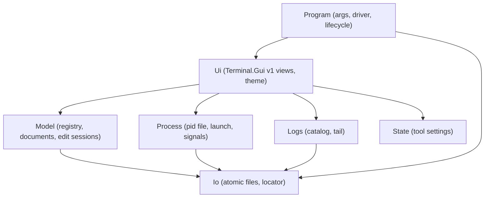
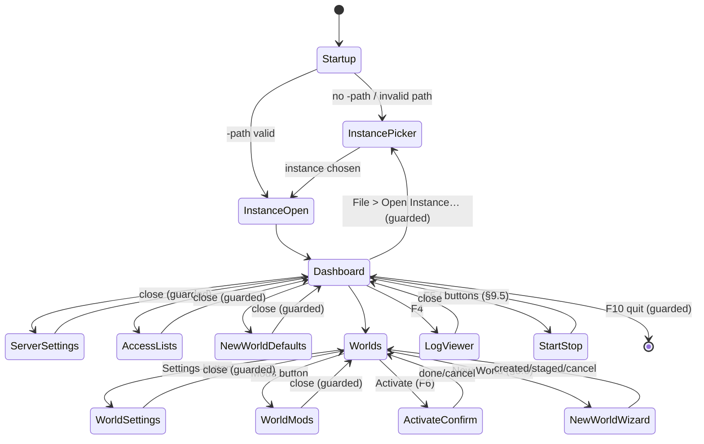
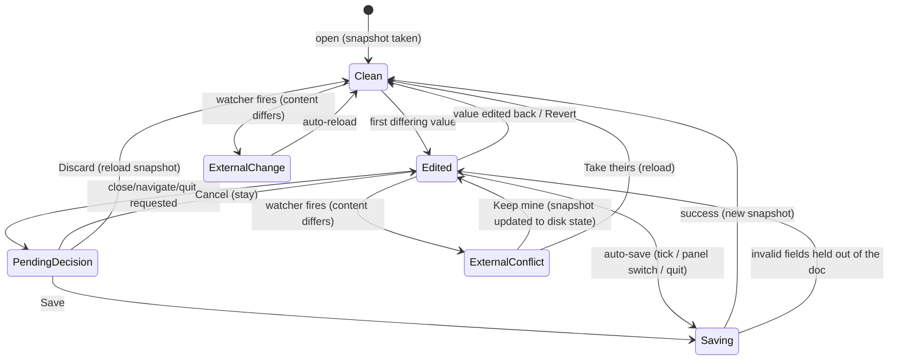
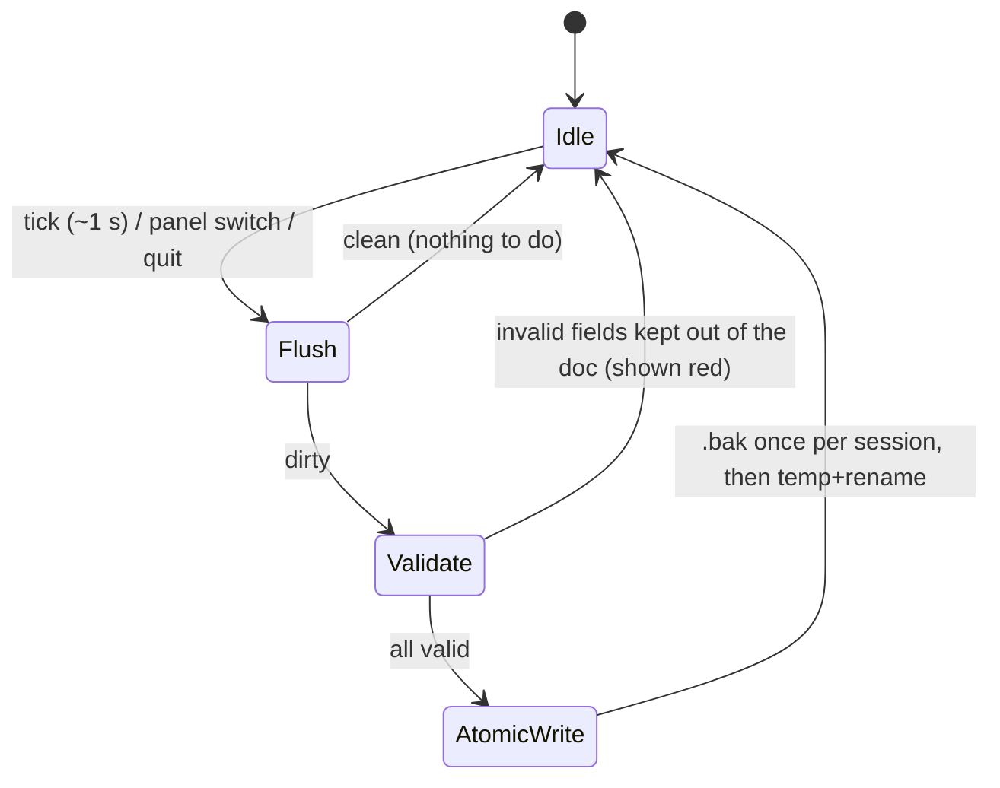
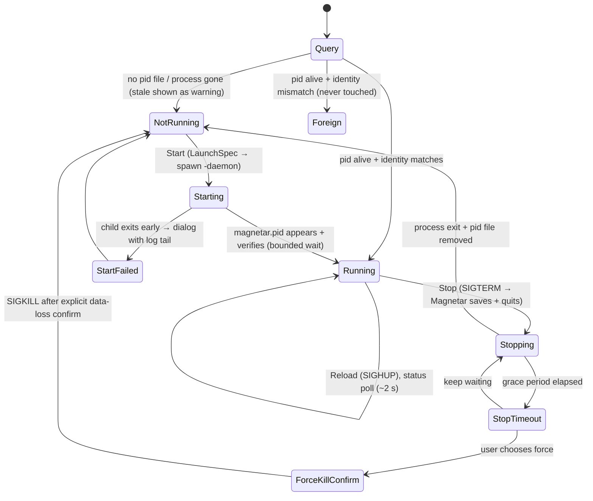

# ConfigTerminal — Design and implementation notes

Technical companion to the **[MagnetarConfig user manual](ConfigTerminal.md)**.
The manual covers installing, running and operating the tool; this document
covers how it is built — the file formats it edits, the architecture and data
model, the option registry, the I/O layer, the UI theme, the internal state
machines, cross-platform mechanics, testing, packaging, and the known
limitations and future work.

> **Section numbering.** The numbers below are kept aligned with the original
> combined design document so the many internal cross-references resolve. The
> user-facing sections — §1 (purpose and scope), §8.2–8.4 (screens, the option
> form, keys) and §10 (command line) — now live in the
> [user manual](ConfigTerminal.md); they are intentionally absent here.

## Table of contents

2. [Background: the files being edited](#2-background-the-files-being-edited)
3. [What we take from Quasar / what we do differently](#3-what-we-take-from-quasar--what-we-do-differently)
4. [Architecture and project placement](#4-architecture-and-project-placement)
5. [Data model](#5-data-model)
6. [The option metadata registry](#6-the-option-metadata-registry)
7. [File I/O layer](#7-file-io-layer)
8. [UI design (Turbo Vision theme)](#8-ui-design)
9. [State machines](#9-state-machines)
11. [Cross-platform notes](#11-cross-platform-notes)
12. [Testing strategy](#12-testing-strategy)
13. [Build, packaging and documentation integration](#13-build-packaging-and-documentation-integration)
14. [Implementation status](#14-implementation-status)
15. [Known limitations and future work](#15-known-limitations-and-future-work)

---

## 2. Background: the files being edited

Verified against the decompiled DS (build 1.209.024). This section is the
normative reference for the file formats; implementation must re-verify
details marked *(verify)* against `se-dev-server-code` when the code is written.

### 2.1 Directory layout of one Magnetar instance

The tool binds to a *pair* of folders (both overridable — see the
[user manual](ConfigTerminal.md#2-running-magnetarconfig)):

```
<DS data dir>  (-path)                  ← DS "UserDataPath"
├── SpaceEngineers-Dedicated.cfg        ← global config (XML, MyConfigDedicated root)
├── SpaceEngineersDedicated.log         ← game log (written by the DS per start)
└── Saves/
    ├── LastSession.sbl                 ← which world loads next (plain XML)
    ├── <World A>/
    │   ├── Sandbox.sbc                 ← checkpoint (may be GZip-compressed!)
    │   ├── Sandbox_config.sbc          ← settings/mods/name (plain XML, authoritative)
    │   ├── SANDBOX_0_0_0_.sbs          ← sector data (never touched)
    │   └── Backup/…                    ← DS-made backups (skipped)
    └── <World B>/…

<Magnetar config dir>  (-config)        ← Magnetar's own state
├── config.xml                          ← Magnetar CoreConfig
├── info_yyyyMMdd_HHmmssfff.log         ← Magnetar log, one per startup
├── info.current                        ← name of the active log file
├── magnetar.pid                        ← PID file, see §2.8
├── ConfigTerminal.xml                  ← this tool's own settings (see the manual)
└── Profiles/, Sources/, …              ← plugin config (not edited by this tool)

<DS install dir>  (read-only)
├── DedicatedServer64/…                 ← binaries (auto-detected or -ds64)
└── Content/CustomWorlds/<Template>/    ← world templates (§2.7)
```

Defaults — DS data dir: Windows interactive `%APPDATA%\SpaceEngineersDedicated`,
Windows service `%ProgramData%\SpaceEngineersDedicated\<InstanceName>`, Linux
`~/.config/SpaceEngineersDedicated` (what
`Environment.GetFolderPath(ApplicationData)` resolves to). Magnetar config
dir: Linux `$XDG_CONFIG_HOME/Magnetar` → `~/.config/Magnetar`; Windows
`<launcher dir>\MagnetarLegacy|MagnetarInterim` (see
[Configuration.md](Configuration.md)).

### 2.2 `SpaceEngineers-Dedicated.cfg`

- Serialized POCO: `MyConfigDedicatedData<MyObjectBuilder_SessionSettings>`
  (`VRage.Game/MyConfigDedicatedData.cs`), root element
  `<MyConfigDedicated>`, written with plain `XmlSerializer`.
- ~45 fields; full list with defaults lives in the option registry
  ([§6](#6-the-option-metadata-registry)). Notable quirks:
  - `AutoRestatTimeInMin` — Keen's typo **is the real element name**.
  - `Administrators` is `List<string>` serialized with
    `[XmlArrayItem("unsignedLong")]` → `<Administrators><unsignedLong>…`.
  - `NetworkParameters` uses `[XmlArrayItem("Parameter")]`.
  - `ServerPasswordHash`/`ServerPasswordSalt`: PBKDF2
    (`Rfc2898DeriveBytes(password, salt, 10000)`, 20-byte hash, 16-byte
    salt, both base64).
  - `DedicatedId` is lazily generated by the DS on first read and saved back —
    the tool must preserve it and **never** regenerate it.
  - `RemoteSecurityKey` is generated by the DS when defaulted — preserve it.
- Missing file → the DS runs `SetDefault()`; a partially populated file is
  fine because `XmlSerializer` leaves absent elements at their defaults.
  Therefore the tool **upserts only the fields the user actually sets** and
  keeps everything else untouched (including unknown fields from newer game
  versions).

### 2.3 `Saves/LastSession.sbl`

- Class `MyObjectBuilder_LastSession`; despite the extension it is a plain
  uncompressed XML object-builder, root `<MyObjectBuilder_LastSession>`.
- Fields the tool writes: `Path` (absolute world dir), `RelativePath`
  (relative to `Saves/` — **checked first** by the DS, keeps saves portable),
  `GameName` (world display name), `IsContentWorlds=false`, `IsOnline=false`,
  `IsLobby=false`.
- World-selection precedence in the DS
  (`MySandboxGame.cs` dedicated branch):
  1. CLI `-session:<path>` (pins the LastSession branch),
     `-ignorelastsession` skips it;
  2. `LastSession.sbl` (unless `IgnoreLastSession` is true in cfg or CLI);
  3. cfg `LoadWorld` (bare names resolve under `Saves/`);
  4. new world from `PremadeCheckpointPath` + cfg `SessionSettings`.
- So "activate world W" =
  write `LastSession.sbl` → upsert `IgnoreLastSession=false` in the cfg.
  The tool also *displays* `LoadWorld` if set and offers to clear it, since a
  stale `LoadWorld` only matters when `LastSession.sbl` is missing/ignored,
  and leaving both set is confusing.

### 2.4 `Sandbox_config.sbc` vs `Sandbox.sbc`

- `Sandbox_config.sbc` → `MyObjectBuilder_WorldConfiguration`, only four
  members: `Settings` (`MyObjectBuilder_SessionSettings`), `Mods`
  (`List<ModItem>`), `SessionName`, `LastSaveTime`. Always written
  uncompressed on every DS save.
- On load the DS reads `Sandbox.sbc` **then overrides** `Settings`, `Mods`
  and (if non-empty) `SessionName` from `Sandbox_config.sbc` when present.
  → editing `Sandbox_config.sbc` is the correct, minimal way to change a
  world's settings; `Sandbox.sbc` never needs to be written.
- `Sandbox.sbc` may be GZip-compressed; the reader must sniff the magic bytes
  and unwrap. Only used as a *fallback* to display world info when
  `Sandbox_config.sbc` is missing (old saves); in that case the tool creates
  `Sandbox_config.sbc` on first save of that world (the DS then honours it).
- `ModItem` element shape:
  `<ModItem FriendlyName="…"><Name>{id}.sbm</Name><PublishedFileId>{id}</PublishedFileId><PublishedServiceName>Steam</PublishedServiceName><IsDependency>false</IsDependency></ModItem>`.
  List order **is** load order.

### 2.5 Session settings serialization quirks

- Enums are serialized **by name**, not number (verified against the
  decompiled enums): `GameMode` Creative=0/Survival=1; `OnlineMode`
  OFFLINE=0/PUBLIC=1/FRIENDS=2/PRIVATE=3; `EnvironmentHostility`
  SAFE=0/NORMAL=1/CATACLYSM=2/CATACLYSM_UNREAL=3; `BlockLimitsEnabled`
  NONE=0/GLOBALLY=1/PER_FACTION=2/PER_PLAYER=3 (note: FACTION before
  PLAYER).
- `AFKTimeountMin` — another Keen typo that is the real element name.
- `BlockTypeLimits` is `SerializableDictionary<string, short>` →
  `<dictionary><item><Key>…</Key><Value>…</Value></item>…</dictionary>`,
  with a non-empty default set (Assembler=24, Refinery=24, … ShipGrinder=150).
- `ShouldSerialize*` gates mean some elements are legitimately absent
  (`ProceduralDensity`/`ProceduralSeed` only when density > 0,
  `EncounterDensity` only when > 0, `AutoSave`/`TrashFlags` never).
  Upsert semantics handle this naturally: absent element = default.
- `PermanentDeath` is `bool?`.
- Experimental-mode coupling: the DS flags settings combos as experimental
  (`MaxPlayers` above safe cap, `PhysicsIterations != 8`,
  `SyncDistance > 3000`, `BlockLimitsEnabled == NONE`, `TotalPCU` above cap,
  `ProceduralDensity > 0.35`, …) and *forces* `ExperimentalMode=true` on load
  when any DS plugins are configured. The UI surfaces this as a non-blocking
  warning badge, mirroring the rules.

### 2.6 What is live-reloadable

`ServerControl.ReloadConfig` (Magnetar) saves the world and calls
`MySandboxGame.ConfigDedicated.Load()` on the game thread. Per its comments:
MOTD is recomputed per join, admin/ban lists are read live for new
connections, and the browser server name gets an explicit push. Everything
else — ports, network type, session settings, world selection — needs a
restart. The option registry records this per field (`Liveness`), and the UI
shows "applies live via reload" vs "requires server restart" per edited field.

### 2.7 World templates and new-world creation

Verified against the decompiled DS and its WinForms configurator
(`ConfigForm.cs`):

- Templates are ordinary world folders under
  **`<ContentPath>/CustomWorlds/<Template>/`** (`MyLocalCache.CustomWorlds`,
  `ConfigForm.cs:891`), where `ContentPath` is the `Content/` folder sibling
  to `DedicatedServer64/` in the DS install. Each contains `Sandbox.sbc`
  (+ usually `Sandbox_config.sbc`; the configurator's listing reads
  `configOnly: true`) and sector data.
- Template display names can be **localization keys**: the configurator runs
  `SessionName` through `MyTexts.GetString(MyStringId.GetOrCompute(...))`
  (`ConfigForm.cs:1109`). The tool has no localization tables, so it shows
  the raw `SessionName` (which `GetOrCompute` also falls back to) and the
  folder name.
- The stock configurator does **not** copy the template itself. For a new
  world it sets `PremadeCheckpointPath = <template path>` and clears `LoadWorld`
  (`ConfigForm.cs:1959-1969`); the **DS materializes the world** under `Saves/`
  on the next start via its new-world branch
  ([§2.3](#23-saveslastsessionsbl) precedence step 4). That start-based path is
  fragile for a config tool — if the operator stops (kills) the server before it
  first saves, nothing is written and no world appears.
- **The tool instead copies the template folder directly** into `Saves/<name>`
  and stamps the name into the copied `Sandbox_config.sbc`
  (`WorldCreator.CreateFromTemplate`). This works because on load the DS reads
  `Sandbox.sbc` and then **overrides Settings/Mods/SessionName from
  `Sandbox_config.sbc`** (`MyLocalCache.LoadCheckpoint` — *"Sandbox world
  configuration file found, overriding checkpoint settings"*), so the small
  config file is authoritative and the large (often gzipped) checkpoint is never
  parsed or rewritten. The world exists and is editable **before any start**, and
  the tool activates it (writes `LastSession.sbl`) so the DS loads it next.
- The only thing a copy skips is the DS's creation-time generation
  (`RandomizeSeed`/`ProceduralSeed`, asteroid generation). The stock CustomWorlds
  already ship their content, so a copy is faithful for them; a
  `RandomizeSeed=true` scenario simply reuses the template's seed, editable
  afterward in World Settings.

The tool copies the template directly (robust, instant, editable-before-start)
rather than driving the DS to materialize it. The world's own
`Sandbox_config.sbc` carries its settings and mods verbatim from the template —
"the config is created from the world, so it matches" — and the user edits it
under Worlds like any other world, with no server start required.

### 2.8 Process model and PID file

Magnetar runs daemonized (`-daemon`): on Linux a `setsid()` detach — when
spawned as a *child* (our case) it detaches **in place, keeping the PID**
(`Legacy/Launcher/Daemon.cs`); the re-exec path only triggers when Magnetar is
itself a process-group leader, which does not happen when this tool spawns it.

Magnetar today writes **no PID file** — this branch adds one to the launcher
(a small `Legacy`/`Shared` change shipped together with this tool):

- `magnetar.pid` in the **Magnetar config dir** (next to `info.current`),
  written after daemon detach so it always holds the final PID; content is
  the PID in the first line and the resolved DS data dir in the second line
  (lets the tool confirm the process belongs to *this* instance).
- Deleted on clean shutdown; a crash leaves it stale, so the reader always
  verifies: process with that PID exists **and** its identity matches
  (executable/cmdline contains Magnetar/SpaceEngineersDedicated; on Linux
  `/proc/<pid>/cmdline` should reference the same `-path`). Mismatch ⇒
  reported as *stale*, never killed.

Stop semantics: **SIGTERM** → Magnetar's existing handler saves the world and
quits (`ServerControl.OnTerminate`, net10.0 only); SIGHUP → save + config
reload. On Windows there is no clean signal path to a detached process —
graceful stop there is deferred to a later phase (planned route: the DS
Remote API or a named-event listener added to Magnetar; see
[§15](#15-known-limitations-and-future-work)). Force-kill is offered only after a
graceful stop times out, behind an explicit "may lose progress since last
save" confirmation.

### 2.9 Log files

Two log groups, both covered by the log reader:

- **Game log** — the DS logs into the *data dir* (`MyInitializer.InvokeBeforeRun`
  receives `userDataPath` as the log path, `DedicatedServer.cs:198`), file
  name `SpaceEngineersDedicated.log` (+ rotated/dated variants; the reader
  globs `SpaceEngineersDedicated*.log`).
- **Magnetar logs** — one `info_yyyyMMdd_HHmmssfff.log` per startup in the
  Magnetar config dir; `info.current` names the active file (see
  [Configuration.md](Configuration.md)). The reader treats the file named by
  `info.current` as "live" and lists older ones by timestamp.

Both formats are plain text with .NET-style exception traces (an exception
message line followed by indented `   at Namespace.Type.Method(...)` frames);
SE additionally logs thread/timestamp prefixes. The viewer displays the raw
text and highlights "Game ready" / "Exception" lines and offers plain
next/previous text search; exception-traceback indexing/navigation (grouping and
stepping whole stack traces) is **not implemented** (see
[§5.9](#59-log-reading)).

---

## 3. What we take from Quasar / what we do differently

### Adopted from Quasar (proven in practice)

| Quasar mechanism | Adopted as |
| --- | --- |
| Single declarative option table (`QuasarConfigMetadata.Options`) driving the editor UI, serialization and import | `OptionRegistry` ([§6](#6-the-option-metadata-registry)) — one source of truth for ~230 options |
| `XDocument` **upsert** editing of DS XML — never deserialize Keen types, preserve unknown elements | The whole document layer ([§5.2](#52-document-wrappers)) |
| Keen quirks encoded as *data*: enum XML names, preserved typos (`AutoRestatTimeInMin`, `AFKTimeountMin`), `<unsignedLong>` admins, `BlockTypeLimits` dictionary, tolerant bool parsing (`true/false/1/0`), int-or-name enum parsing | Quirk fields on `OptionDefinition` + dedicated codecs |
| PBKDF2 password hashing identical to the DS | `PasswordHasher` |
| `LastSession.sbl` writing with both `Path` and `RelativePath`, plus `IgnoreLastSession=false` | `LastSessionFile` + world-activation flow |
| Atomic writes (temp file + rename, flush, never truncate the target on failure) | `AtomicFile` ([§7](#7-file-io-layer)) |
| Clean → Edited → PendingDecision editing state machine with Cancel/Discard/Save | `EditSession` ([§9.2](#92-document-edit-lifecycle)) |
| Debounced file watcher that re-checks content before signalling external change | `ExternalChangeWatcher` *(not implemented — see [§15](#15-known-limitations-and-future-work))* |
| World validation: selected save must exist and contain `Sandbox.sbc` | World activation guard |
| UTF-8 no-BOM, `\n` newlines, indented XML with declaration | `XmlOut` writer settings |
| `ReadConfigProfile` — import a world's `Sandbox_config.sbc` into an editable profile | New-world wizard seeds settings from the chosen template ([§2.7](#27-world-templates-and-new-world-creation)) |
| Launching Magnetar with `-daemon -config … -path …`, forbidding conflicting session args on the launch line | `LaunchSpec` builder ([§5.8](#58-process-control)) |

### Deliberately different

| Quasar | ConfigTerminal | Why |
| --- | --- | --- |
| Authoritative **JSON profiles** rendered to DS XML at server start; DS files are disposable render targets | **The DS files are the single source of truth**; the tool edits them in place | Quasar owns the whole server lifecycle and re-renders on every start. A local config tool must coexist with hand edits, Quasar itself, and the DS's own saves; a parallel profile store would drift. No reconciliation loop exists to repair drift. |
| Profiles shared across servers, `History/` snapshots per mutation | One instance at a time; single `.bak` per file (matching Magnetar's existing `ProfilesConfig` convention) | Simplicity; history can be added later without format changes. |
| Web UI (Blazor), editing decoupled from a supervisor process | Terminal.Gui v1 TUI, direct file editing | The whole point of this tool. |
| Fleet supervisor: many servers, `GoalState` reconciliation loop, agent WebSocket channel, auto-restart policy | Single instance, direct start/stop, PID-file status polling, no reconciliation | The tool operates exactly one Magnetar (one folder pair); Magnetar's own `AutoRestartEnabled` watchdog covers in-process restarts. |
| Manages Magnetar plugin/source config and agent deployment | Manages plugins (local, dev-folder, hub) and plugin **sources** by editing `Profiles/Current.xml` + `Sources/sources.xml` in place; **mods are per-world** (`Sandbox_config.sbc`), not per-profile; **agent deployment stays out of scope** | We adopt Quasar's source→profile model for plugins but as in-place XDocument upserts (no parallel store); unlike Quasar, mods belong to the world, not the profile; and we never deploy/compile agents — Magnetar owns that. |
| Blocks `-ignorelastsession` in launch args, forces `IgnoreLastSession=false` silently | Explains the precedence and asks before flipping `IgnoreLastSession` | The user may have set it deliberately; a local tool should be transparent, not managerial. |
| Password always re-rendered from profile | Password write-only field: set/clear only, existing hash preserved untouched | We don't store the plaintext anywhere. |

---

## 4. Architecture and project placement

### 4.1 New solution projects

```
ConfigTerminal/                      → executable "MagnetarConfig"
├── ConfigTerminal.csproj            net10.0 (Linux + Windows)
├── Program.cs                       driver selection, launcher/instance pickers, top-level errors
├── Cli.cs                           argument parsing → InstanceBinding, -help/-diag text
├── Diagnostics.cs                   headless -diag report (no Terminal.Gui)
├── Model/                           pure data layer — NO Terminal.Gui dependency
│   ├── OptionModel.cs               OptionDefinition record + OptionKind/Scope/Liveness enums
│   ├── OptionRegistry.cs            the declarative tables (dedicated + session options)
│   ├── ConfigDocumentBase.cs        shared XDocument upsert base for both config docs
│   ├── DedicatedConfigDocument.cs   XDocument wrapper for the .cfg (+ access lists, password)
│   ├── WorldConfigDocument.cs       XDocument wrapper for Sandbox_config.sbc
│   ├── CheckpointReader.cs          read-only, gzip-aware Sandbox.sbc info reader
│   ├── LastSessionFile.cs           read/write LastSession.sbl
│   ├── WorldCatalog.cs              enumerate Saves/ (WorldInfo)
│   ├── ModList.cs                   ModItem + ordered mod list (load order, IsDependency)
│   ├── PasswordHasher.cs            PBKDF2 hashing identical to the DS
│   ├── WorldTemplateCatalog.cs      enumerate <DS install>/Content/CustomWorlds
│   ├── WorldCreator.cs              copy a template into Saves/<name> and stamp the name
│   ├── DsInstance.cs                aggregate root (+ InstanceBinding) binding all of the above
│   ├── EditSession.cs               snapshot / dirty-tracking / validation engine
│   ├── PluginProfileDocument.cs     XDocument wrapper for Profiles/*.xml
│   │                                 (Local DLLs, DevFolder, GitHub hub plugins; Mods preserved, not edited)
│   ├── PluginSourcesDocument.cs     XDocument wrapper for Sources/sources.xml
│   │                                 (Remote/Local hub + plugin sources; ModSources preserved, not edited)
│   ├── ProfileCatalog.cs            named-profile management (load/save/update/rename/delete)
│   ├── MagnetarPlugins.cs           facade joining catalog + profile + sources
│   ├── PluginManifest.cs            read a dev-folder plugin manifest .xml
│   ├── ProtoReader.cs               minimal protobuf wire reader (no protobuf-net dep)
│   ├── HubCatalog.cs                parse Sources/{Hubs,Plugins}/*.bin → HubPluginInfo
│   ├── WorkshopResolver.cs          keyless Steam Workshop name + collection resolution
│   ├── DefaultHttpFetcher.cs        injectable IHttpFetcher (System.Net.Http)
│   └── Json/MiniJson.cs             dependency-free JSON reader for the resolver
├── Io/
│   ├── AtomicFile.cs                temp+rename atomic writer, .bak backup
│   ├── XmlOut.cs                    shared XmlWriterSettings / Utf8StringWriter
│   ├── PlatformPaths.cs             per-platform defaults + IsLinux
│   └── InstanceLocator.cs           folder-pair resolution, DS install / launcher detection
├── Process/                         Magnetar instance control — no Terminal.Gui dependency
│   ├── ServerStatus.cs              ServerState enum + status record
│   ├── PidFileReader.cs             read/verify magnetar.pid (stale/foreign detection)
│   ├── LaunchSpec.cs                builds the Magnetar command line
│   ├── MagnetarProcess.cs           spawn daemonized, SIGTERM/SIGHUP/SIGKILL, poll state
│   └── ProcessMonitor.cs            periodic state refresh feeding the UI
├── Logs/                            log reading — no Terminal.Gui dependency
│   ├── LogCatalog.cs                discover game + Magnetar log files, active markers
│   ├── LogTailReader.cs             windowed backward reads + follow (tail -f)
│   └── ReadinessDetector.cs         "Game ready" marker scan (present, currently unused)
├── Ui/
│   ├── TurboVisionTheme.cs          ColorSchemes + border styles
│   ├── DesktopBackground.cs         blue ▒ desktop fill
│   ├── AppShell.cs                  Toplevel: menu bar, status bar, desktop, navigation, auto-save
│   ├── IAutoSaveContent.cs          auto-save contract for editable panels
│   ├── InstancePickerDialog.cs      folder-pair / launcher / ds64 picker
│   ├── DashboardView.cs             server status + start/stop/restart/reload controls
│   ├── OptionFormView.cs            generic registry-driven settings form (the workhorse)
│   ├── WorldsView.cs                worlds list: Settings/Mods/Activate/New/Delete
│   ├── NewWorldWizard.cs            template pick → name → confirm → copy + activate (§9.6)
│   ├── ModListView.cs               per-world mod list editor
│   ├── AccessListView.cs            admins / banned / reserved + GroupID editors
│   ├── PasswordDialog.cs            set / clear server password
│   ├── LogViewerView.cs             read-only log view: follow (End), top (Home), wrap (W), refresh (R)
│   ├── PluginsView.cs               local DLLs + registered dev folders
│   ├── HubPluginsView.cs            browse hub catalog + dev folders, enable (with dependencies)
│   ├── PluginSourcesView.cs         manage remote/local hub + remote plugin sources
│   ├── ProfilesView.cs              load/save/update/rename/delete named profiles
│   ├── ManifestPicker.cs            dev-folder manifest .xml picker
│   ├── FileDialogs.cs               open-file / open-directory helpers with Browse buttons
│   ├── HelpDialog.cs                About/Help dialog
│   └── Dialogs.cs                   confirm/destructive/prompt/info/error + RunBackground
└── State/
    └── ToolSettings.cs              ConfigTerminal.xml: last plugin-manifest folder

ConfigTerminalTests/
└── ConfigTerminalTests.csproj       xUnit, net10.0, fixture files
```

**Companion Magnetar-side change (same branch):** the launcher writes
`magnetar.pid` per [§2.8](#28-process-model-and-pid-file) —
`Legacy/Launcher/PidFile.cs` writes it after the daemon detach (from
`Program.SetupGame`) and deletes it in the clean-shutdown path
(`ServerControl.FlushAll`). Small, isolated, and useful on its own (ops scripts).

Naming: assembly `MagnetarConfig`. Both the Windows and Linux bundles ship the
net10.0 build (framework-dependent, requiring the .NET 10 runtime, same as
`MagnetarInterim`). Follows `Legacy.csproj` conventions: `Platforms=x64`,
`LangVersion=latest`, icon + long-path manifest on Windows.

### 4.2 Dependencies

| Package | Version | Notes |
| --- | --- | --- |
| `Terminal.Gui` | **1.19.0** (latest stable v1) | Targets net472 / netstandard2.0 / net6 / net8 → compatible with net10.0. **v1 API only** — the NuGet page and repo now foreground v2 (beta); when consulting docs/samples, use the v1 branch (`develop_v1`?) and the archived v1 API reference at https://gui-cs.github.io/Terminal.Gui/. |
| `NStack.Core` | 1.1.1 (transitive) | `ustring` used throughout the v1 API. |
| `System.Management` | 9.0.4 (transitive) | Pulled by Terminal.Gui (WSL/console detection). |

**No references to game assemblies, `Shared`, `PluginSdk`, or `Compiler`.**
The tool must start instantly, run without a DS install present, and never
load Keen types (that is what makes the XDocument approach robust across game
updates). `Model/` + `Io/` have no Terminal.Gui dependency either, so the data
layer is unit-testable headless and reusable later (e.g. by the launcher or a
CLI batch mode).

The intentional coupling to Magnetar is *behavioural*, not compile-time:
identical `-path`/`-config` semantics, the `.bak` convention, spawning the
launcher executable with `-daemon`, the `magnetar.pid` contract ([§2.8](#28-process-model-and-pid-file)),
the `info_*.log`/`info.current` log layout, and the SIGTERM/SIGHUP lifecycle
handshake.

### 4.3 Layering



Strict rules: `Ui` renders and routes input; every config mutation goes
through an `EditSession` on a `Model` document; every disk write goes through
`Io.AtomicFile`; every process operation goes through `Process` (no view ever
calls `System.Diagnostics.Process` or `System.IO` directly). `Model`,
`Process` and `Logs` are Terminal.Gui-free and fully testable headless.

---

## 5. Data model

### 5.1 Aggregate root

```csharp
sealed class InstanceBinding                // the identity of "the one instance"
{
    string DataDir;                         // -path  (DS UserDataPath)
    string MagnetarConfigDir;               // -config (Magnetar state, logs, pid)
    string MagnetarExePath;                 // launcher to spawn (resolved/validated)
    string Ds64Dir;                         // DS install (templates; auto-detected)
}

sealed class DsInstance
{
    InstanceBinding Binding;
    string ConfigPath;                      // <DataDir>/SpaceEngineers-Dedicated.cfg
    string SavesPath;                       // <DataDir>/Saves
    DedicatedConfigDocument Config;         // lazily loaded
    WorldCatalog Worlds;                    // enumerated from Saves/
    WorldTemplateCatalog Templates;         // from <Ds64Dir>/../Content/CustomWorlds
    LastSessionFile LastSession;            // null when absent
    // derived:
    WorldInfo ActiveWorld;                  // resolved via LastSession precedence rules
    InstanceProblems Problems;              // missing dirs, unreadable files, etc.
}
```

`DsInstance.Open(binding)` never throws for content problems — it records them
in `Problems` so the UI can open *anything* and show what is wrong (a config
tool that refuses to open a broken instance is useless for repair). A missing
DS install only disables the template list; a missing Magnetar executable only
disables start/stop — everything else keeps working.

### 5.2 Document wrappers

Both config documents share one base:

```csharp
abstract class ConfigDocumentBase
{
    XDocument Xml;                 // loaded with LoadOptions.PreserveWhitespace
    string FilePath;
    bool ExistsOnDisk;

    // typed access via the registry:
    OptionValue Get(OptionDefinition def);       // element value or def.Default
    bool IsSet(OptionDefinition def);            // element present?
    void Set(OptionDefinition def, OptionValue v);  // upsert (create element if absent)
    void Unset(OptionDefinition def);            // remove element → DS default applies

    void Save(AtomicFile writer);  // serialize via XmlOut settings
}

sealed class DedicatedConfigDocument : ConfigDocumentBase
{
    // scope roots: "/" (MyConfigDedicated) and "/SessionSettings"
    // extra typed accessors for non-registry structures:
    IList<string> Administrators;       // <unsignedLong> items
    IList<ulong> Banned, Reserved;
    void SetPassword(string plaintext); // PBKDF2 → Hash+Salt; null → clear both
    bool HasPassword { get; }
    // creates a minimal skeleton when the file does not exist:
    // <MyConfigDedicated xmlns:xsi xmlns:xsd><SessionSettings/></MyConfigDedicated>
}

sealed class WorldConfigDocument : ConfigDocumentBase
{
    // scope root: "/Settings" (session options), plus:
    string SessionName;
    DateTime? LastSaveTime;             // read-only, set by the DS
    ModList Mods;
    // when Sandbox_config.sbc is absent: bootstrapped from CheckpointReader
    // (settings/mods/name copied from Sandbox.sbc) and created on first save.
}
```

Key semantics (straight from Quasar's proven approach):

- **Upsert only.** Unknown elements, ordering of untouched elements, and
  comments are preserved. `Set` on a missing element inserts it (placement:
  registry order relative to known siblings; end of scope element otherwise).
- **Read tolerantly**: bools accept `true/false/1/0`; enums accept the int
  value or the XML name; whitespace trimmed; unparsable values surface as
  `OptionValue.Invalid(raw)` which the UI shows with a warning instead of
  crashing or silently rewriting.
- **`Unset` support** matters: writing every known default would freeze the
  DS's defaults at this game version. A field the user never touched stays
  absent.

### 5.3 Worlds

```csharp
sealed class WorldCatalog
{
    IReadOnlyList<WorldInfo> Worlds;    // sorted by LastSaveTime desc
    static WorldCatalog Scan(string savesPath);   // skips non-dirs, Backup/, dirs without Sandbox.sbc
}

sealed class WorldInfo
{
    string FolderName;                  // bare name — the identity used in RelativePath
    string FolderPath;
    string SessionName;                 // from Sandbox_config.sbc, else Sandbox.sbc
    DateTime? LastSaveTime;
    long SizeBytes;                     // folder size (async, filled in later)
    int ModCount;
    bool HasWorldConfig;                // Sandbox_config.sbc present?
    bool HasCheckpoint;                 // Sandbox.sbc present? (activation guard)
    bool IsActive;                      // matches resolved LastSession target
}
```

`CheckpointReader` reads only the handful of fields needed for display
(`SessionName`, `Settings`, `Mods`) from a possibly-GZip `Sandbox.sbc` using a
forward-only `XmlReader` over the decompressed stream — it never materializes
the (potentially huge) entity tree.

### 5.4 LastSession

```csharp
sealed class LastSessionFile
{
    string Path;                // absolute world dir
    string RelativePath;        // relative to Saves/ when the world is under it
    string GameName;
    bool IsContentWorlds, IsOnline, IsLobby;   // all false for our use

    static LastSessionFile Read(string sblPath);        // tolerant, null on missing
    static LastSessionFile ForWorld(WorldInfo w, string savesPath);
    void Write(AtomicFile writer, string sblPath);      // fixed field order, xsi/xsd attrs
}
```

### 5.5 Mods

```csharp
sealed class ModItem
{
    ulong PublishedFileId;
    string FriendlyName;        // XML attribute
    string ServiceName = "Steam";
    bool IsDependency;
    // Name element is always "{PublishedFileId}.sbm" — derived, not stored
}

sealed class ModList          // order == SE load order
{
    IList<ModItem> Items;
    void MoveUp(int i); void MoveDown(int i);
    ValidationResult Validate();   // duplicate IDs, zero IDs
}
```

**Add** accepts either a numeric Workshop id or a Steam Workshop URL (e.g.
`https://steamcommunity.com/sharedfiles/filedetails/?id=657749341`); several can
be pasted at once. `WorkshopResolver` (keyless `ISteamRemoteStorage`
endpoints — no API key) then fills in each mod's **friendly name** so it need
not be typed, expands a pasted collection into its members in the collection's
sort order, and skips non-mods (worlds/blueprints/scripts) with a warning. The
lookup runs off the UI thread (`Dialogs.RunBackground`); when the Workshop is
unreachable the ids are still added by number, just without names.

### 5.6 Edit sessions (dirty tracking + validation)

```csharp
sealed class EditSession
{
    ConfigDocumentBase Document;
    string Snapshot;                    // canonical string form taken at open/save
    bool IsDirty { get; }               // canonical(Document) != Snapshot
    event Action DirtyChanged;

    IReadOnlyList<OptionIssue> Validate();   // per-option range/type + cross-field rules
    IReadOnlyList<OptionDefinition> ChangedOptions();   // for the save summary dialog
    SaveResult Save();                  // validate → backup → atomic write → new snapshot
    void Revert();                      // reload document from Snapshot
}
```

Dirty is computed by *content comparison* (like Quasar's zeroed-timestamp JSON
snapshots), not by counting keystrokes — editing a value back to what it was
clears the dirty flag. Cross-field validation includes the experimental-mode
rules ([§2.5](#25-session-settings-serialization-quirks)) as warnings, and hard
errors only for values the DS would reject or mangle (non-numeric ports, port
collisions between `ServerPort`/`SteamPort`/`RemoteApiPort`, world folder names
containing path separators).

### 5.7 World templates

```csharp
sealed class WorldTemplateCatalog
{
    IReadOnlyList<WorldTemplate> Templates;
    static WorldTemplateCatalog Scan(string ds64Dir);   // <ds64>/../Content/CustomWorlds
}

sealed class WorldTemplate
{
    string FolderName;              // e.g. "Star System"
    string FolderPath;              // absolute — copied into Saves/<name> on create
    string DisplayName;             // raw SessionName (may be a MyTexts key) or folder name
    WorldConfigDocument Seed;       // read-only import of the template's settings + mods
                                    // (Sandbox_config.sbc, fallback gzip-aware Sandbox.sbc)
}
```

### 5.8 Process control

```csharp
enum ServerState { NotRunning, Starting, Running, Stopping, StalePidFile, Foreign }
// Foreign = pid alive but identity mismatch (different instance / recycled PID)

sealed class ServerStatus
{
    ServerState State;
    int? Pid;
    DateTime? StartedAt;            // Process.StartTime → uptime display
    string PidFilePath;
    string Detail;                  // human-readable, e.g. mismatch reason
}

sealed class LaunchSpec             // pure function of the binding + options
{
    InstanceBinding Binding;
    bool IgnoreLastSession;         // adds -ignorelastsession (skips LastSession.sbl)
    string[] ExtraArgs;             // extra launch args, validated against conflicts;
                                    // reserved — no UI exposes it yet, so empty in practice
    string[] BuildArgv();           // <exe> -daemon -config <dir> -path <dir> [...]
                                    // rejects extra args that would fight the tool:
                                    // -session:, -ignorelastsession, -path, -config, -daemon
}

sealed class MagnetarProcess
{
    ServerStatus Query();                       // pid file → verify → status
    Result Start(LaunchSpec spec);              // refuses when already Running
    Result Stop(TimeSpan gracePeriod);          // SIGTERM → wait → escalate prompt
    Result Reload();                            // SIGHUP (Linux, running only)
    // Windows graceful stop: deferred (§15); Query/Start work everywhere.
}

sealed class ProcessMonitor         // Application.MainLoop.AddTimeout ~2 s
{
    ServerStatus Latest;
    event Action<ServerStatus> Changed;         // drives dashboard + status bar
}
```

Spawn details: `UseShellExecute = false`, stdout/stderr redirected to the null
device (Magnetar logs to files; keeping an inherited pipe open would tie the
daemon to the tool), working directory = the launcher's directory. The child
detaches in place via `-daemon` (PID stable, [§2.8](#28-process-model-and-pid-file));
`Start` then waits for `magnetar.pid` to appear (bounded) to transition
Starting → Running, surfacing early exits with the log tail in an error dialog.

### 5.9 Log reading

```csharp
enum LogGroup { Game, Magnetar }

sealed class LogFileInfo
{
    string Path; LogGroup Group;
    DateTime LastWrite; long Size;
    bool IsActive;                  // info.current match, or newest game log
}

sealed class LogCatalog
{
    IReadOnlyList<LogFileInfo> Files;           // both groups, newest first
    static LogCatalog Scan(InstanceBinding b);  // SpaceEngineersDedicated*.log + info_*.log
}

sealed class LogTailReader          // never loads the whole file
{
    // windowed access: opens at EOF, reads the last N KB (default 256),
    // line-indexes the window (hard cap 20k lines)
    IReadOnlyList<string> Lines;
    void Load();                    // (re)read the tail window
    bool Poll();                    // read appended bytes on the follow tick (700 ms)
}
```

The viewer stays thin: `End` toggles follow, `Home` jumps to the top, `W`
toggles line wrap, `R` re-reads the window, `/` opens the Find dialog, `n` / `N`
step to the next / previous match, `[` / `]` jump to the previous / next
highlighted line, and `Esc` clears whichever is active — a search (dropping the
match selection) or a highlight-navigation status — restoring the default hint
line (a `transientStatus` flag tracks when the status line holds a search or
highlight message rather than the hints). Search is delegated to Terminal.Gui's own
`TextView.FindNextText` / `FindPreviousText` over the loaded window — no separate
index. The Find dialog carries the term plus **Case sensitive** and **Whole words
only** toggles, passed through as `matchCase` / `matchWholeWord` and remembered
across invocations. A fresh term anchors the search at the top of the window so
the first match is the topmost one, not merely the first below the tail the viewer
opened at; wrap-around is done explicitly (Terminal.Gui only wraps once its find
anchor has advanced past the start, so a first search from the tail would
otherwise miss everything above it — the viewer re-anchors to the far end and
retries on a miss). `[` / `]` navigation is separate from the text search (it
never disturbs the term): it scans the reader's logical lines with
`LogHighlight.Classify` for the previous / next highlighted line and wraps around;
line indices map 1:1 to the pane's rows while word-wrap is off (the default), so
with wrap on the jump is approximate. Lines matching the
`LogHighlight` markers ("Game ready", "Exception") are colour-tinted via a
`TextView` subclass that overrides the per-rune `SetReadOnlyColor` /
`SetNormalColor` hooks; because the pane is read-only the redraw resolves
selection (search matches) before the highlight, so a match stays visible on a
highlighted line. On open the pane scrolls to the tail, but the first `Render`
runs from the constructor — before the view is added to the tree and laid out,
when the pane height is still 0 and `Adjust` would pin only the last line to the
top; the scroll is therefore deferred and re-applied on the first `LayoutComplete`
once the pane has a real height (a later layout, e.g. a resize after the user
scrolled up, does not re-pin). Full exception-traceback detection/navigation (grouping and
stepping whole stack traces) is **not implemented** (a possible future addition —
see §13); the windowed reader already bounds memory even on multi-GB logs.

### 5.10 Plugin and source management

Magnetar's plugin config is two `XmlSerializer` files the tool edits by the same
upsert discipline as the DS files (unknown elements preserved, Magnetar-managed
fields like `LastCheck`/`Hash` untouched):

- `Profiles/Current.xml` (`Pulsar.Shared.Data.Profile`) — the **enabled set**:
  `Local` (`<string>` DLL file names), `DevFolder` (`<LocalFolderConfig>`),
  `GitHub` (`<GitHubPluginConfig>` naming a hub plugin by its `Id`). `Mods`
  (`<unsignedLong>` Workshop ids) is **preserved but not edited** — the tool never
  writes it, because mods are per-world ([§5.5](#55-mods)). `Profile.Validate()`
  requires all four collections present, so the skeleton still writes an empty
  `<Mods>`.
- `Sources/sources.xml` (`Pulsar.Shared.Config.SourcesConfig`) — the **catalog
  sources**: `RemoteHubSources` (`<RemoteHub>` {Name, Repo, Branch, Enabled,
  Trusted, +managed LastCheck/Hash}), `RemotePluginSources` (`<RemotePlugin>`
  {…, File}), `LocalHubSources`, `LocalPluginSources` (dev folders). `ModSources`
  is likewise preserved but not edited.

```csharp
sealed class MagnetarPlugins        // façade over both documents + the catalog caches
{
    IReadOnlyList<LocalDllInfo>   LocalDlls();          // Local/ folder ∪ Profile.Local
    IReadOnlyList<DevFolderPlugin> DevFolderPlugins();  // LocalPluginSources ⋈ Profile.DevFolder (Enabled flag)
    IReadOnlyList<HubPluginView>  DevFolderCatalogViews(); // dev folders as catalog rows (manifest ⋈ Profile.DevFolder)
    bool                          SetDevFolderEnabled(string id, string dataFile, bool on);
    IReadOnlyList<HubPluginView>  HubCatalogPlugins();  // cached catalog ⋈ Profile.GitHub
    IReadOnlyList<string>         SetHubPluginEnabled(string id, bool on);  // + dependency pull-in
    // source management: {RemoteHubs,RemotePlugins,LocalHubs} × {Add,Remove,SetEnabled}
}
```

**Hub catalog browsing is offline.** Magnetar downloads each hub's catalog into a
protobuf-net blob (`Sources/Hubs/<owner-repo>.bin`, a serialized
`PluginData[]`; single-plugin sources into `Sources/Plugins/*.bin`). The tool
reads these with `ProtoReader` (a ~100-line Protocol-Buffers wire reader) keyed on
the `[ProtoMember]` field numbers of `PluginData`/`GitHubPlugin` — **no
protobuf-net or `Shared` reference, no game types, no network.** Unknown fields are
skipped so a schema growth degrades gracefully; obsolete/hidden entries are
dropped. Enabling a plugin writes `<GitHubPluginConfig><Id>` and transitively
enables its `DependencyIds`, mirroring `PluginData.UpdateProfile`.

**Profiles** are named presets of the enabled set, one XML file per profile under
`Profiles/`, exactly as Magnetar's `ProfilesConfig` stores them:
`Profiles/<Key>.xml` where `Key = CleanFileName(Name)` (invalid filename chars →
`-`, replicated from `Tools.CleanFileName`). `Current.xml` is the **active** set
the server loads and is reserved — never a listed preset.

```csharp
sealed class ProfileCatalog          // mirrors Pulsar.Shared.Config.ProfilesConfig
{
    IReadOnlyList<ProfileInfo> NamedProfiles();  // Profiles/*.xml except Current + .bak
    string ActiveMatchKey();          // the preset whose enabled set equals Current, or null
    bool   SaveCurrentAs(string name);// snapshot Current → new <Key>.xml (false on collision)
    void   Update(string key);        // overwrite an existing preset with the active set
    void   Load(string key);          // copy a preset's enabled set into Current.xml
    void   Rename(string key, string newName);   // delete old file, write under the new key
    void   Delete(string key);        // remove a preset (never Current)
}
```

The operations map 1:1 to Magnetar's `ProfilesConfig` (`Save`/`Add`, `Update` =
overwrite, `Load` = copy-into-Current, `Rename`, `Remove`), but as in-place
XDocument edits rather than round-tripping Keen types — a snapshot/overwrite even
**preserves unknown elements** in the target preset. Unlike Magnetar's in-game UI
(which has no draft↔profile matching), the tool computes an order-independent
signature of the four enabled sets so it can mark *which* preset the active set
currently matches — a small standalone-tool convenience. As everywhere else,
"applies on next server start" holds: loading a profile rewrites `Current.xml`, and
Magnetar re-reads it when it next launches.

---

## 6. The option metadata registry

The single source of truth, modelled on Quasar's `QuasarConfigMetadata` but
richer, because it also drives liveness hints and TUI layout:

```csharp
enum OptionScope { DedicatedRoot, Session }
enum OptionKind  { Bool, Int, UInt, Long, Float, Double, Text, MultilineText,
                   Enum, UlongList, StringList, BlockTypeLimits, Password }
enum Liveness    { RestartRequired, LiveViaReload }

sealed record EnumChoice(int Value, string XmlName, string Label);

sealed record OptionDefinition(
    string Id,               // stable identifier, e.g. "Session.MaxPlayers"
    OptionScope Scope,
    string XmlName,          // exact element name incl. Keen typos
    OptionKind Kind,
    string Category,         // UI grouping, e.g. "Network", "Multipliers"
    string Label,
    string Help,             // one-two sentences, shown in the hint bar / F1
    OptionValue Default,     // the DS default (display when element absent)
    double? Min = null, double? Max = null, double? Step = null,
    EnumChoice[] Choices = null,
    Liveness Liveness = Liveness.RestartRequired,
    bool Hidden = false,     // serialized but not shown (ScenarioEditMode, …)
    bool Experimental = false,
    string ExperimentalRule = null);  // e.g. "PhysicsIterations != 8"
```

`OptionRegistry` exposes:

- `DedicatedOptions` — the ~40 root fields of `MyConfigDedicatedData`
  (excluding the structures with dedicated editors: access lists, password
  pair, `SessionSettings`, and preserve-only fields `DedicatedId`,
  `RemoteSecurityKey`, `ServerPasswordHash/Salt`).
- `SessionOptions` — the ~180 `MyObjectBuilder_SessionSettings` fields,
  grouped into categories mirroring Keen's `[Category]` attributes: *Core*,
  *Multipliers*, *Block Limits*, *Environment*, *Players*, *Gameplay*,
  *NPCs*, *Economy*, *Trash Removal*, *Grid Storage*, *Match & Team* and
  *Experimental*. Options flagged `Hidden` (the `[Browsable(false)]` but
  still-serialized ones, e.g. `ScenarioEditMode`) are kept out of the form
  entirely — there is no "show advanced" reveal toggle.
- Lookup by `Id`, by `XmlName` per scope, enumeration by category.

Population strategy: the tables are **hand-written C# literals**, transcribed
from the decompiled `MyConfigDedicatedData` and
`MyObjectBuilder_SessionSettings` (field names, defaults, ranges, display
names) cross-checked against Quasar's `QuasarConfigMetadata.Options`. A unit
test guards the invariants (unique ids, unique xml names per scope, enum
choices non-empty, min ≤ default ≤ max). We do *not* generate the table at
runtime via reflection over game DLLs — no game dependency, and the table is
the place where quirks and human-quality labels/help live.

The same `OptionFormView` renders any list of `OptionDefinition`s against any
`ConfigDocumentBase`, which is what makes the cfg's SessionSettings template
and each world's settings share one implementation.

---

## 7. File I/O layer

- **`AtomicFile.WriteText(path, content)`** — write to
  `.{name}.{random}.tmp` in the same directory (same filesystem → atomic
  rename), flush stream, then move over the target
  (`File.Replace`/`File.Move` overwrite). On any failure delete the temp and
  leave the target untouched. Before the first overwrite of an existing file
  in a session, copy it to `{path}.bak` (Magnetar's existing convention).
- **`XmlOut`** — shared `XmlWriterSettings`: UTF-8 **without BOM**, `Indent =
  true`, `NewLineChars = "\n"`, XML declaration on. Matches Quasar's proven
  output settings and keeps diffs clean across platforms.
- **`ExternalChangeWatcher`** *(not implemented — see [§15](#15-known-limitations-and-future-work))* —
  a debounced `FileSystemWatcher` per open document plus one on `Saves/`, content
  compared against the session snapshot before raising so a no-op touch does not
  nag, events marshalled to the UI thread via `Application.MainLoop.Invoke`. Until
  it lands, re-open a panel (or use the Worlds **Refresh** button) to pick up an
  external change; auto-save writes are content-compared, so they never rewrite a
  file the user did not actually change.
- **Reads are tolerant**: missing file → skeleton/defaults; malformed XML →
  document opens read-only with the parse error surfaced in the UI and a
  "restore from .bak" offer when one exists (mirrors `ProfilesConfig`'s
  backup-and-reset, but never resets silently).

---

## 8. UI design

### 8.1 Turbo Vision theme

Classic 16-color Turbo Vision / Turbo Pascal 7 IDE look, expressed as
Terminal.Gui v1 `ColorScheme`s in `TurboVisionTheme`:

| Surface | Colors (fg on bg) |
| --- | --- |
| Desktop | `▒` fill glyph, Gray on Blue |
| Menu bar / status bar | Black on Gray; hotkeys Red on Gray; selected item Black on Green |
| Window (editor) | White double-line border on Blue; title White on Blue |
| Dialog | Black on Gray, single/double border per TV convention |
| Buttons | Black on Green (default), Black on Gray (normal), shortcut letters Yellow |
| Input fields | Yellow on Blue (TV edit-field look), focused field highlighted |
| List selection | White on Green (focused), Black on Cyan (unfocused) |
| Error dialog | White on Red |
| Warning badges (experimental / restart-required) | Yellow on Blue |

Implementation notes:

- `Attribute.Make(Color.White, Color.Blue)` etc.; assign
  `Colors.Base/Menu/Dialog/Error` at startup **and** set per-view
  `ColorScheme` where TV differs from Terminal.Gui defaults.
- Desktop fill: a custom `DesktopView` painting `▒` across its bounds.
- Double-line frames: v1 `Border.BorderStyle = BorderStyle.Double` on
  windows; dialogs single-line.
- Everything is within the classic CGA 16-color palette, so it renders
  identically under `WindowsDriver`, `CursesDriver` (any 16-color terminfo)
  and `NetDriver` — no truecolor dependency.

---

## 9. State machines

### 9.1 Application navigation



"guarded" = passes through the pending-changes decision below when the
window's `EditSession.IsDirty`.

### 9.2 Document edit lifecycle

Per open document (cfg, a world's config), mirroring Quasar's
`ConfigProfileChanges` state machine:



Notes:
- Editing has **no explicit Save**: a dirty document is flushed automatically on
  the ~1 s tick, on panel switch, and on quit ([§9.3](#93-save-pipeline)) — the
  `Saving` transition is driven by those triggers, not an `F2` key.
- The `ExternalChange` / `ExternalConflict` transitions are **not implemented**
  (`ExternalChangeWatcher`, [§15](#15-known-limitations-and-future-work)). Today an external write is
  picked up on the next panel re-open / Refresh; because auto-save is
  content-compared, it will not silently overwrite a file that changed to a value
  the user did not touch.

### 9.3 Save pipeline (auto-save)

There is no explicit save step. Each editable panel implements
`IAutoSaveContent`; the shell flushes any dirty panel on three triggers — a
~1 s main-loop tick, a panel switch (before the old panel is disposed), and
quit. A flush is a no-op when the panel is clean (a cheap `touched` flag gates
the expensive canonical-string comparison) and it never blocks or pops a dialog.



- Free-typed fields that do not parse are shown **red** and held *out* of the
  document, so a half-typed value is never written; a field commits once it
  becomes valid.
- On panel switch and on quit, any still-invalid fields are surfaced in a
  confirm dialog (`InvalidFields`) rather than silently discarded.
- Reloading a running server after a live-reloadable change is a manual action
  (`Server → Reload Config` → SIGHUP on Linux), not an automatic post-save
  prompt.

### 9.4 World activation

```
Activate (F6 in Worlds) on world W:
  guard: W.HasCheckpoint            → else error dialog ("no Sandbox.sbc")
  guard: FolderName has no path separators
  compute: Path = abs(W), RelativePath = W.FolderName, GameName = W.SessionName
  show confirm dialog listing the exact writes:
    1. Saves/LastSession.sbl  ← new content
    2. cfg IgnoreLastSession  ← false (only if currently true; asks explicitly)
    3. cfg LoadWorld          ← offer to clear (only if set; optional checkbox)
  on confirm: three writes through AtomicFile (cfg via its EditSession so a
  dirty settings window sees the flag change), refresh WorldCatalog.IsActive
  note: "takes effect on next server start; -session: on the command line
  overrides this selection"
```

### 9.5 Magnetar process lifecycle

Primary signal: the `magnetar.pid` file ([§2.8](#28-process-model-and-pid-file)),
verified against the live process; fallback for older Magnetar builds without
the PID file: best-effort process scan (name + cmdline `-path` match).



- The `ProcessMonitor` polls `Query` on the UI main loop; every state change
  updates the status bar and dashboard.
- Restart = Stop → Start with the same `LaunchSpec` (used by the
  activate-world and save flows when the user opts in).
- Start is refused while `Running` or `Foreign`; `Foreign` and stale-PID
  states are display-only diagnoses — the tool never signals a process whose
  identity it could not confirm.
- We do **not** lock config editing while the server runs (same decision as
  Quasar): the DS reads the cfg at startup only, and world-file conflicts are
  handled by the ExternalConflict path of §9.2. A running server is reflected
  in the save summary ("settings load at next start") and the SIGHUP offer.
- Windows: Start/Query work identically; graceful Stop is deferred
  ([§15](#15-known-limitations-and-future-work)).

### 9.6 New-world creation

Creation by folder copy ([§2.7](#27-world-templates-and-new-world-creation)) —
no server start. The DS loads a dedicated world by reading `Sandbox.sbc` and
then overriding Settings/Mods/SessionName from `Sandbox_config.sbc`
(`MyLocalCache.LoadCheckpoint`: *"Sandbox world configuration file found,
overriding checkpoint settings"*), so copying the template folder and stamping
the name into its `Sandbox_config.sbc` is a complete, immediately editable world.

```
Wizard: template → name → confirm → create (WorldCreator.CreateFromTemplate)
  1. pick WorldTemplate                 (requires DS install; else wizard disabled)
  2. enter world name                   (no path separators; warn if a Saves/
                                         folder or SessionName already matches)
  3. confirm summary                    Saves/<name>/         ← copy of template
                                        Sandbox_config.sbc SessionName ← name
                                        (LastSaveTime refreshed so it sorts first)
  4. create (background copy):
       • copy template → hidden Saves/.<name>.creating staging folder
       • stamp SessionName into the copied Sandbox_config.sbc (synthesize it
         from the checkpoint if the template shipped none)
       • Directory.Move staging → Saves/<name> (atomic; no half-world on failure)
  5. activate (ActivateCreatedWorld): write LastSession.sbl for the new world,
       set cfg IgnoreLastSession=false, clear LoadWorld and any stale
       PremadeCheckpointPath → ReloadInstance. It appears in the Worlds list
       and is the world the DS loads next.
```

The only DS behaviour a copy skips is creation-time generation (`RandomizeSeed`
/ procedural asteroid generation); the stock CustomWorlds already ship their
content, so a copy is faithful for them. A `RandomizeSeed=true` scenario reuses
the template's seed (editable afterward in World Settings). The big (often
gzipped) `Sandbox.sbc` is copied verbatim and never parsed/rewritten.

Failure paths: the copy is assembled in a staging folder and moved into place,
so a mid-copy failure leaves no partial world (the staging folder is removed and
the error is surfaced); a name collision is rejected before any copy.

---

## 11. Cross-platform notes

Developed and used on Linux now; must work on Windows unchanged later:

- **Drivers**: `Application.Init()` auto-selects `CursesDriver` on Linux and
  `WindowsDriver` on Windows; `-netdriver` maps to
  `Application.UseSystemConsole = true`. No driver-specific code anywhere
  else. The TV palette is 16-color so all drivers render it.
- **Signals / OS split**: signal sending (SIGTERM stop, SIGHUP reload) uses
  `kill(2)` via a small P/Invoke (as .NET has no managed "send signal" API) and
  is gated at runtime on Linux (`PlatformPaths.IsLinux`). On Windows: Start,
  status (PID file + `Process.GetProcessById`) and the log reader work
  identically; graceful Stop/Reload are deferred to a later phase (planned
  route: DS Remote API or a named-event listener in Magnetar — see §15). The
  Stop button on Windows explains this and offers only the confirmed force-kill.
- **Paths**: `Path.Combine` everywhere; never assume separator or case
  sensitivity. World folder matching for `IsActive` compares
  case-insensitively on Windows, case-sensitively on Linux (a
  `PathComparer` helper). Note the DS `Saves` scan on Linux runs under
  Magnetar's case-insensitive path patching — the tool itself reads the
  real filesystem, so exact names are used for writes and display.
- **Console**: UTF-8 output (`Console.OutputEncoding`) set on Windows before
  `Application.Init` so `▒`, `═` and badges render on classic conhost;
  Windows Terminal works out of the box. Keep every glyph within CP437 so the
  TV look survives legacy code pages.
- **Line endings/encoding of outputs** are fixed by `XmlOut` (UTF-8 no BOM,
  `\n`) — platform-independent, and matches what Quasar writes.

---

## 12. Testing strategy

On Linux, for testing on a terminal use `tmux` if available.

New xUnit project `ConfigTerminalTests` (patterned on `PluginSdkTests`):

- **Registry invariants** — unique ids/xml names, enum choices sane, defaults
  within min/max, every §2 quirk present (a test literally asserts
  `XmlName == "AutoRestatTimeInMin"` so nobody "fixes" the typo).
- **Round-trip fixtures** — golden files captured from a real DS instance
  (a pristine cfg written by the DS, a world's `Sandbox_config.sbc`, a
  gzip-compressed and an uncompressed `Sandbox.sbc`, a `LastSession.sbl`):
  - open → save with no edits ⇒ semantically identical XML (element-level
    comparison; whitespace normalization allowed);
  - open → set one option → save ⇒ only that element (plus file-level
    formatting) differs; unknown injected elements survive.
- **Codecs** — `BlockTypeLimits` dictionary, mod list (attribute +
  `{id}.sbm` derivation, order preservation), `<unsignedLong>` admins,
  tolerant bool/enum parsing including int-vs-name enums.
- **PasswordHasher** — vectors generated against the DS algorithm
  (PBKDF2/SHA1, 10000 iterations, 20 bytes) to guarantee a password set by
  the tool actually admits players.
- **LastSession** — `ForWorld` produces `RelativePath` for worlds under
  `Saves/` and omits it otherwise; precedence documentation encoded as tests
  of `DsInstance.ActiveWorld` resolution.
- **EditSession** — dirty by content, revert, external-change rebase logic.
- **AtomicFile** — crash-injection style: failing writer leaves target +
  creates no temp litter; `.bak` created once per session.
- **PidFile** — parse, stale detection (dead PID), foreign detection
  (identity mismatch fixture), round-trip with the Magnetar-side writer
  (shared fixture format); Magnetar side gets its own test that the file
  appears after startup and disappears on clean exit.
- **LaunchSpec** — argv construction for both platforms; rejection of
  conflicting user extra args (`-session:`, `-ignorelastsession`, `-path`,
  `-config`, `-daemon`); `IgnoreLastSession` flag injection.
- **LogCatalog** — game + Magnetar log discovery and active-file marking is
  exercised by the live end-to-end test. (`LogTailReader`'s windowed reads and
  follow-mode appends currently have no dedicated unit tests; exception-traceback
  indexing is not implemented — see §5.9.)
- **LogHighlight** — the "Game ready" / "Exception" line classifier behind the
  viewer's colour highlighting is unit-tested (`LogHighlightTests`); the UI smoke
  tests open the log viewer over a seeded log and cover that the colour overrides
  reach the cell buffer, that the tail shows a full screen on open, and that
  search (with case / whole-word options), clearing the search, and
  highlighted-line navigation behave.
- **WorldTemplateCatalog / WorldCreator** — template scan fixture tree;
  `CreateFromTemplate` copies the template into `Saves/<name>`, stamps
  `SessionName`, synthesizes `Sandbox_config.sbc` when the template has only a
  checkpoint, rejects an existing folder, and leaves no staging folder behind.
- **Plugin / source config** — profile and sources upsert round-trips
  (`GitHub`, `RemoteHub`/`RemotePlugin`/`LocalHub`) with sibling (incl. the
  preserved `Mods`/`ModSources`) and Magnetar-managed-field preservation; the
  `MagnetarPlugins` façade's catalog-join and dependency pull-in
  (`PluginConfigTests`). Interop against the **deployed `Magnetar.Shared.dll`**:
  the tool-written `Profile` and `SourcesConfig` deserialize with Magnetar's own
  `XmlSerializer` and pass `Profile.Validate()`, and a tool-written **named
  profile** is discovered and validated by Magnetar's real `ProfilesConfig.Load`
  (`PluginInteropTests`).
- **Profile management** — `ProfileCatalog` save-new (+ collision), load
  round-trip, update-overwrite, rename (file move), delete, the reserved-"Current"
  guards, and `CleanFileName`-compatible keying (`ProfileCatalogTests`).
- **Hub catalog reader** — the `ProtoReader`/`HubCatalog` wire parser against a
  **real captured `magnetar-hub.bin`** fixture (identity, kind, `RepoId`, author,
  dependencies), plus empty/missing-file cases (`HubCatalogTests`).
- **UI smoke tests** — Terminal.Gui v1 ships `FakeDriver` (used by its own
  test suite): instantiate the shell headless, drive key events
  (open form → edit → auto-save flush → assert file content), and navigate every primary view
  including the Plugins views. Kept minimal — the logic lives below the UI on
  purpose.

`Sandbox.sbc` fixtures must be small hand-made worlds (empty sector), not
real saves, to keep the repo lean.

---

## 13. Build, packaging and documentation integration

- `Magnetar.sln` carries the `ConfigTerminal` + `ConfigTerminalTests` projects.
- `build.sh` / `build.bat` ship `MagnetarConfig` in each bundle next to
  the launcher. Rather than co-mingling it with the launcher's own
  assemblies, it gets its own folder + a root launcher, mirroring how the
  MagnetarInterim apphost sits under `Bin/` with a root shim — so its
  Terminal.Gui/NStack/System.Management deps stay isolated and can never clash
  with the launcher's:
  - **Linux** (`Scripts/package_magnetar_for_linux.sh`): a framework-dependent
    net10.0 publish is staged into `Magnetar/Config/`, with a `Magnetar/MagnetarConfig`
    bash launcher (`cd Config; exec ./MagnetarConfig`) beside `Magnetar/MagnetarInterim`.
    `install.sh` deploys both to `~/.local/share/Magnetar/`, so the tool runs as
    `~/.local/share/Magnetar/MagnetarConfig`.
  - **Windows** (`build.bat`): a framework-dependent net10.0 publish (requires the
    .NET 10 runtime, same as `MagnetarInterim`) is staged into `<Magnetar>\Config\`,
    with a `<Magnetar>\MagnetarConfig.bat` shim next to `MagnetarInterim.exe`.
  Both packagers verify the config apphost/shim is present before packing, and
  the Linux path-leak check covers the staged `Config/` tree.
- Terminal.Gui + NStack.Core (and System.Management) DLLs land next to the
  executable in its own folder (normal `dotnet publish` behaviour; no native
  components, so no changes to the native-wrapper release flow).
- Docs integration: `README.md` (documentation table + a "Configuration tool"
  note), `Docs/Usage.md` ("Configuring the server (MagnetarConfig)" section) and
  `Docs/Layout.md` (`ConfigTerminal/` + `ConfigTerminalTests/` rows) cover the
  tool. The machine-generated code handbook (`Docs/TOC.md` / `Docs/Index.md` +
  per-file module docs, via the `structured-documentation` refresh) covers the
  `ConfigTerminal/` and
  `ConfigTerminalTests/` trees (modules `ConfigTerminal.{App,Model,Ui,Process,Logs,Io}`
  and `ConfigTerminalTests`).

---

## 14. Implementation status

The tool is built and in daily use on Linux; every layer in the source map
([§4.1](#41-new-solution-projects)) exists and is exercised by
`ConfigTerminalTests`. What that covers, and the few gaps:

- **Config editing** — the full `OptionRegistry` (dedicated + all session
  categories), the `DedicatedConfigDocument`/`WorldConfigDocument` upserts, the
  access-list and password editors, `EditSession` auto-save, `WorldCatalog` /
  `CheckpointReader` (gzip-aware), the mod-list editor and the world-activation
  flow (`LastSessionFile`) are all in place.
- **Process control** — the Magnetar-side `magnetar.pid` writer plus
  `PidFileReader`, `LaunchSpec`, `MagnetarProcess` and `ProcessMonitor` drive the
  dashboard's Start / Stop / Restart / Reload. Graceful stop (SIGTERM) and reload
  (SIGHUP) are **Linux-only**; on Windows only Start, status and force-kill work
  ([§15](#15-known-limitations-and-future-work)).
- **New worlds + logs** — the New World wizard copies a template into `Saves/`
  and activates it with no server start (`WorldCreator`); the log viewer follows
  (`End`), wraps (`W`), re-reads (`R`), jumps to top (`Home`), searches (`/` with
  case / whole-word toggles, `n`/`N`, `Esc` to clear), steps between highlighted
  lines (`[`/`]`) and highlights "Game ready" / "Exception" lines.
  Exception-traceback navigation is **not implemented** ([§5.9](#59-log-reading)).
- **Plugin management** — local DLLs, dev folders, offline hub-catalog browsing
  (`ProtoReader`/`HubCatalog`), source management and named profiles
  (`ProfileCatalog`) are all present, surfaced in the four Plugins views and by
  `-diag`, and covered by round-trip + interop tests. Per-server mod management
  (`Profile.Mods`/`ModSources`) is deliberately absent — mods are per-world
  ([§5.5](#55-mods)); the keyless `WorkshopResolver` (name + collection) backs
  the per-world **Add mod by URL** flow.
- **Not implemented** — the `ExternalChangeWatcher` external-change / conflict
  flow ([§9.2](#92-document-edit-lifecycle)), a "show advanced" reveal toggle for
  `Hidden` options, and Windows graceful stop/reload. `ToolSettings` persists
  only the last plugin-manifest folder
  ([user manual](ConfigTerminal.md#2-running-magnetarconfig)) — not recent instance pairs,
  per-pair overrides or extra launch args; the instance picker pre-fills resolved
  defaults rather than offering a recent-pairs list.
- **Verification** — the Linux bundle is produced end-to-end by `build.sh` as
  `dist/MagnetarForLinux.7z`. The main open item is a manual driver pass on
  Linux xterm/kitty/ssh and Windows Terminal/conhost.

---

## 15. Known limitations and future work

- **Terminal.Gui v1 doc drift** — the NuGet page and repo README now
  describe v2 (beta). Mitigation: pin 1.19.0, consult only the archived v1
  API docs, and keep the UI layer thin so a future v2 (or other library)
  migration only touches `Ui/`.
- **`System.Management` transitive dependency** — pulled in by Terminal.Gui;
  restores cleanly on net10.0. The tool no longer multi-targets net48, so the
  earlier netstandard2.0-restore concern is moot.
- **Session-settings enum member names** — the four headline enums in §2.5
  are verified against the decompiled source; the remaining enum-typed
  session options are transcribed the same way (from the decompiled source,
  never guessed).
- **Element insertion order** — `XmlSerializer` reads out-of-order elements
  fine for these types; if any consumer turns out to be order-sensitive, the
  registry already carries enough ordering information to insert at the
  canonical position.
- **Concurrent edits with a running DS** — the DS rewrites
  `Sandbox_config.sbc` and `LastSession.sbl` on every autosave; the
  external-change / conflict flow (§9.2) that would reconcile this is **not
  implemented**, so an external write is picked up only on the next panel
  re-open / Refresh. Auto-save is content-compared, so it never silently
  overwrites a value the user did not touch.
- **Instance discovery on Linux** — only the Magnetar-launched layout is
  well-defined; Wine/Proton installs put the instance elsewhere. The picker's
  manual path entry covers it; no auto-discovery attempted.
- **Windows graceful stop** — no signal path to a detached process; SIGTERM
  handling in Magnetar is net10-only anyway (`#if NETCOREAPP`). Candidate
  mechanisms, decided when Windows support is implemented: the DS Remote API
  (`RemoteApiEnabled` + `RemoteSecurityKey` already in the cfg) or a named
  event Magnetar listens on (companion launcher change like the PID file).
  Until then Windows gets Start/status/logs but only confirmed force-kill.
- **PID file only in new Magnetar builds** — an older Magnetar started
  outside the tool leaves no `magnetar.pid`; the process-scan fallback
  (§9.5) covers status but not reliable identity. Acceptable: the tool ships
  in the same bundle as the launcher that writes the file.
- **World folder naming** — the wizard copies the template into `Saves/<name>`
  using the name entered, and rejects a name that collides with an existing
  folder or `SessionName` before any copy (§9.6), so the folder name is
  predictable rather than derived by the DS.
- **Template settings import fidelity** — some templates may lack
  `Sandbox_config.sbc` or use localization-key session names; the wizard
  falls back to the checkpoint and folder names, and the settings form shows
  exactly what was imported, so nothing is silently invented.
- **Log size/performance** — SE logs can reach GBs on long-running servers;
  the windowed reader (§5.9) bounds memory, but rendering and search UX on
  huge files would benefit from profiling with real logs.
- **Hub catalog is read-only / offline** — the tool browses whatever Magnetar
  has already cached in `Sources/{Hubs,Plugins}/*.bin`; it never fetches or
  refreshes a catalog itself. Add a source, then start the server once so
  Magnetar populates the cache. A newly-added source therefore shows no plugins
  until that first start — the Hub Plugins view says so. Fetching catalogs
  in-tool (GitHub zip walk like Quasar/Magnetar) is a possible later addition.
- **Protobuf catalog format coupling** — the offline reader keys on the
  `[ProtoMember]` field numbers of `PluginData`/`GitHubPlugin`. These are part of
  Magnetar's on-disk cache contract and stable, but a field-number change would
  need the reader updated; `HubCatalogTests` (real-fixture) catches regressions,
  and unknown fields are skipped so additive changes are harmless.
- **Future**: Windows graceful stop / live-reload channel via the Remote API,
  in-tool hub catalog refresh, timestamped edit history. All deliberately
  excluded now; the layering keeps them cheap to add.
