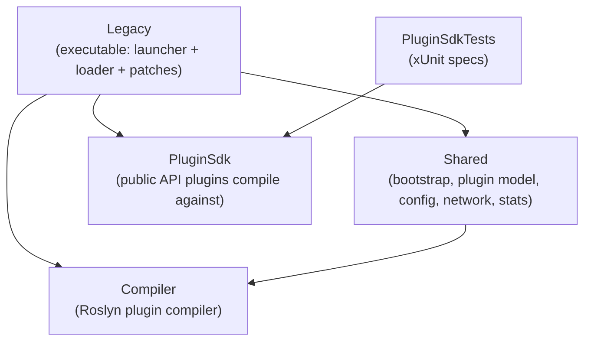
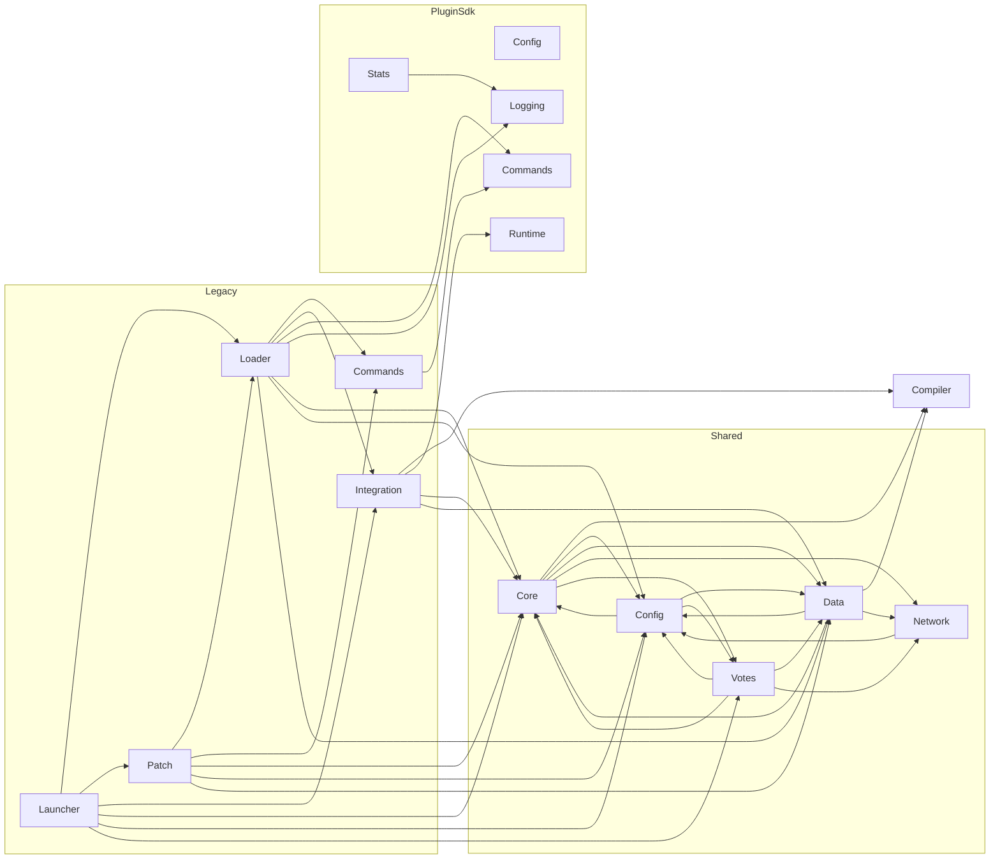
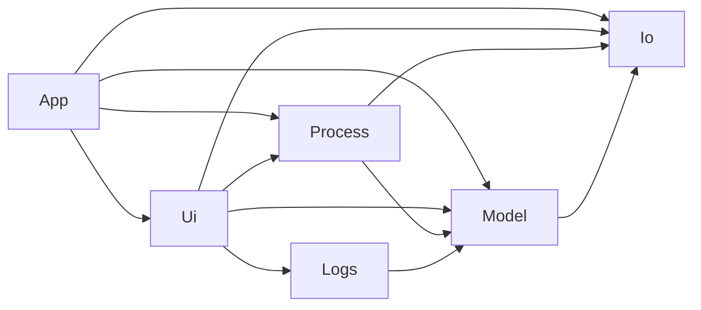

# Magnetar — Code Handbook

A structured, navigable reference for the **Magnetar** source tree. Magnetar is
a plugin and mod loader for the **Space Engineers (SE1) Dedicated Server**, a
hard fork of [Pulsar](https://github.com/SpaceGT/Pulsar) (hence the `Pulsar.*`
namespaces) adapted to run the headless DS on both Windows (.NET Framework 4.8,
the **Legacy** launcher) and Linux/.NET 10 (the **Interim** launcher) — no
WinForms, no Telerik UI, no Windows-service host.

> This handbook is generated from the source by the `structured-documentation`
> skill. It is regenerable and incremental: see [data/README.md](data/README.md).
> For the *plugin-author* view of the public API, read the
> **[`se-dev-plugin-sdk`](../skills/se-dev-plugin-sdk/SKILL.md)** skill handbook;
> this handbook instead documents Magnetar's own internals file-by-file.

## How to read this handbook

Progressive disclosure, three levels deep:

1. **This page (`TOC.md`)** — project overview, architecture, and the module catalog.
2. **Module docs (`modules/*.md`)** — one per subsystem: purpose, key types, the
   full file list, public API surface, and inter-module dependencies.
3. **File descriptions (`descriptions/**/*.cs.md`)** — one per source file: a
   summary, every type with its fields/properties/methods/events, and
   `Uses` / `Used by` cross-references.

Need a flat list instead? **[`Index.md`](Index.md)** lists every documented
file with its module, tier, and one-line summary.

Related docs (start from the [`../README.md`](../README.md) for the short intro):

- **[`Install.md`](Install.md)** — prebuilt bundles and installing.
- **[`Usage.md`](Usage.md)** — running the launcher, daemon mode, handoff.
- **[`Configuration.md`](Configuration.md)** — config/install dirs, DS detection, environment variables.
- **[`Plugins.md`](Plugins.md)** — plugin hubs and the trust boundary.
- **[`Build.md`](Build.md)** — per-platform build, dependency staging, publishing, and build-time overrides.
- **[`Layout.md`](Layout.md)** — repository layout.
- **[`../skills/se-dev-plugin-sdk/`](../skills/se-dev-plugin-sdk/SKILL.md)** — plugin-developer handbook for `PluginSdk`.

## Architecture at a glance

Magnetar ships two executables built from one solution. Both replace
`SpaceEngineersDedicated.exe` and, before the game's own `Main` runs, resolve
the DS install, apply preloader Harmony patches, compile and load enabled
plugins, then hand off to the dedicated server.

| Executable | Target | Platform | Assembly |
| ---------- | ------ | -------- | -------- |
| **MagnetarLegacy** | .NET Framework 4.8 | Windows only | `Legacy.csproj` (net48) |
| **MagnetarInterim** | .NET 10 | Windows + Linux | `Legacy.csproj` (net10.0) |

A third executable, **MagnetarConfig** (`ConfigTerminal.csproj`, net10.0), ships
in the same solution and bundle but is a **standalone operator tool**, not a DS
replacement: a Terminal.Gui (Turbo Vision) TUI that configures and operates one
instance from outside the running game, referencing no game or `Shared`
assemblies. It has its own module group in the catalog below, a user manual at
[`ConfigTerminal.md`](ConfigTerminal.md) and a design/implementation reference at
[`ConfigTerminalInternals.md`](ConfigTerminalInternals.md).

The launcher/plugin-loader code is organised into five .NET solution projects.
Their compile-time reference direction (a strict DAG) is the backbone of the
module layering below:

`Compiler` and `PluginSdk` are leaves (no project references). `Shared` builds on
`Compiler`. `Legacy` sits on top of everything and is the only executable.

### Launch sequence (high level)

1. **Native bootstrap** (Linux) — `NativeLibraryPreloader` dlopens bundled `.so`
   files and aliases Windows DLL names. *(Legacy.Loader)*
2. **Preloader patches** — `Preloader` applies the early Harmony patches that
   redirect paths and intercept DS startup. *(Shared.Core, Legacy.Patch)*
3. **Resolve install & config** — locate the DS, read `CoreConfig` and the active
   `Profile`, build the `PluginList`. *(Legacy.Launcher, Shared.Config, Shared.Core, Shared.Data)*
4. **Acquire plugins** — download from GitHub/NuGet, fetch Steam Workshop mods,
   resolve dependencies. *(Shared.Network, Shared.Data, Legacy.Loader)*
5. **Compile** — Roslyn compiles source plugins in an isolated context, with
   publicized SE assemblies as references. *(Compiler, Legacy.Integration)*
6. **Load & run** — `PluginLoader` instantiates each plugin, injects services,
   registers SE components, wires the chat-command pipeline and the mission-screen
   senders (backing client popups via the bundled `MagnetarMod` world mod), then
   drives the SE plugin lifecycle. *(Legacy.Loader, Legacy.Commands, Legacy.Integration, PluginSdk.*)*
7. **Hand off** to the dedicated server's own `Main`.

## Module catalog

Grouped by project. Click a module for its full doc.

### `Legacy` — the launcher executable

| Module | Files | Lines | What it does |
| ------ | ----- | ----- | ------------ |
| [Legacy.Launcher](modules/Legacy.Launcher.md) | 5 | 1455 | Launcher bootstrap & entry point: argument parsing, DS detection, environment setup, daemon detach, and handoff to the game's `Main`. |
| [Legacy.Loader](modules/Legacy.Loader.md) | 6 | 1078 | Runtime plugin host & native bootstrap: instantiates plugins, drives their SE lifecycle, registers components, manages the implicit MagnetarMod client companion, wires the mission-screen senders, prefetches Workshop mods (expanding legacy archives), preloads native libs. |
| [Legacy.Patch](modules/Legacy.Patch.md) | 12 | 528 | All Harmony patches that adapt the DS binary to Magnetar's headless, in-process, externally-configured hosting model, including injecting the MagnetarMod client companion into SE's mod-loading pipeline. |
| [Legacy.Commands](modules/Legacy.Commands.md) | 3 | 243 | Host side of the `!`-prefixed chat-command pipeline and the built-in `!save` / `!restart` / `!quit` / `!stop` commands. |
| [Legacy.Integration](modules/Legacy.Integration.md) | 7 | 613 | Glue to SE internals: isolated Roslyn compilation host, Linux case-insensitive path resolution, and the host-side mission-screen sender that pushes popups to clients via the MagnetarMod world mod. |

### `Shared` — cross-target infrastructure

| Module | Files | Lines | What it does |
| ------ | ----- | ----- | ------------ |
| [Shared.Core](modules/Shared.Core.md) | 11 | 2240 | Core bootstrap layer: preloader, plugin list, updater, Steam helpers, assembly resolution, command-line flags, shared tools. |
| [Shared.Data](modules/Shared.Data.md) | 11 | 1897 | The plugin-entry data model (GitHub / local-folder / local / mod / obsolete plugins, profiles, status), plus legacy Workshop `*_legacy.bin` archive expansion. |
| [Shared.Config](modules/Shared.Config.md) | 12 | 530 | All persistent installation configuration: core config, profiles, plugin sources, and the instance.id consent anchor. |
| [Shared.Network](modules/Shared.Network.md) | 7 | 892 | Outbound network I/O: GitHub REST/CDN, a full NuGet v3 client, and a lightweight HTTP façade. |
| [Shared.Votes](modules/Shared.Votes.md) | 7 | 361 | Opt-in client-side telemetry and community plugin-rating layer, with the consent state machine that gates it. |

### `Compiler` — the plugin compiler

| Module | Files | Lines | What it does |
| ------ | ----- | ----- | ------------ |
| [Compiler](modules/Compiler.md) | 5 | 605 | In-process Roslyn compiler that builds SE plugins from source, resolving and publicizing the SE assembly closure as references. |

### `PluginSdk` — the public plugin API

| Module | Files | Lines | What it does |
| ------ | ----- | ----- | ------------ |
| [PluginSdk.Config](modules/PluginSdk.Config.md) | 5 | 1832 | Declarative, attribute-driven plugin configuration → local XML, remote JSON envelope, and Quasar UI schema. |
| [PluginSdk.Commands](modules/PluginSdk.Commands.md) | 17 | 1289 | The chat-command framework: attribute-declared handlers, registry, dispatcher, argument binding, permissions, mission-screen help rendering. |
| [PluginSdk.Logging](modules/PluginSdk.Logging.md) | 8 | 425 | Unified, environment-agnostic logging API (game log standalone, structured JSON under Quasar). |
| [PluginSdk.Runtime](modules/PluginSdk.Runtime.md) | 7 | 484 | Host-agnostic path resolution, dedicated-server lifecycle control (`ServerControl`), and mission-screen popups (`MissionScreens`) pushed to clients. |
| [PluginSdk.Stats](modules/PluginSdk.Stats.md) | 4 | 498 | Self-describing runtime telemetry: attribute-declared counters / gauges / discrete values published as snapshots a consumer (Quasar Agent) rolls up and charts. |

### `PluginSdkTests` — specifications

| Module | Files | Lines | What it does |
| ------ | ----- | ----- | ------------ |
| [PluginSdkTests](modules/PluginSdkTests.md) | 8 | 2261 | xUnit tests that specify and regression-guard every public `PluginSdk` API. |

### `MagnetarMod` — companion in-game world mod

An SE1 `Data/Scripts` mod compiled in-game, shipped alongside the launcher and
auto-loaded as an implicit client mod (unless disabled with `-noimplicitmod` or
running crossplay). It is the client-side receiver for server-pushed content.
`MagnetarMod/MagnetarMod.csproj` is an MDK2 project for IDE support, local
builds, and ModAPI analyzer coverage. It is present in `Magnetar.sln`, but only
the `Workshop|Any CPU` solution configuration selects it for build; normal
`Debug`/`Release` solution builds skip it.

| Module | Files | Lines | What it does |
| ------ | ----- | ----- | ------------ |
| [MagnetarMod](modules/MagnetarMod.md) | 1 | 114 | Session component that receives mission-screen payloads from the server over a secure multiplayer channel and renders them via the SE ModAPI — the client counterpart to `PluginSdk.MissionScreens` / `Legacy.Integration`'s mission-screen sender. |

### `ConfigTerminal` — the configuration TUI (MagnetarConfig)

A standalone Terminal.Gui (Turbo Vision) operator tool that edits and runs one
Magnetar DS instance from the terminal — no game or `Shared` references. Layered
`Model` / `Io` / `Process` / `Logs` below a `Ui` shell, with an `App` entry
layer. User manual: [`ConfigTerminal.md`](ConfigTerminal.md); design and
file-format reference: [`ConfigTerminalInternals.md`](ConfigTerminalInternals.md).

| Module | Files | Lines | What it does |
| ------ | ----- | ----- | ------------ |
| [ConfigTerminal.App](modules/ConfigTerminal.App.md) | 4 | 379 | Entry point, CLI parsing → `InstanceBinding`, driver/launcher/instance selection, the headless `-diag` report, and persisted tool settings (`ConfigTerminal.xml`). |
| [ConfigTerminal.Model](modules/ConfigTerminal.Model.md) | 24 | 3862 | Pure data layer: the option registry, XDocument-upsert wrappers for the DS/world/last-session files, world/template/mod models, edit-session dirty tracking, and the plugin/profile/source/hub-catalog/Workshop-resolver models. |
| [ConfigTerminal.Ui](modules/ConfigTerminal.Ui.md) | 21 | 3452 | Terminal.Gui presentation: app shell, the generic registry-driven settings form, worlds/mods/access-list/password/plugin/profile editors, new-world wizard, log viewer, dialogs and theme; editable panels auto-save. |
| [ConfigTerminal.Process](modules/ConfigTerminal.Process.md) | 5 | 524 | Controls the one instance: `magnetar.pid` read/verify (stale/foreign detection), the daemon launch spec, detached spawn, SIGTERM/SIGHUP/force-kill, and status polling. |
| [ConfigTerminal.Logs](modules/ConfigTerminal.Logs.md) | 3 | 331 | Discovery and memory-bounded tail/follow reading of the DS game logs and Magnetar `info_*.log` files. |
| [ConfigTerminal.Io](modules/ConfigTerminal.Io.md) | 4 | 316 | Atomic `.bak` file writes, shared XML writer settings, per-platform paths, and instance/launcher/DS-install resolution. |

### `ConfigTerminalTests` — configuration-tool specs

| Module | Files | Lines | What it does |
| ------ | ----- | ----- | ------------ |
| [ConfigTerminalTests](modules/ConfigTerminalTests.md) | 10 | 1465 | xUnit specs for the config tool: registry invariants, document round-trips, process/pid/atomic-file, plugin/profile/sources upsert + Magnetar-serializer interop, hub-catalog protobuf reader, Workshop resolver, FakeDriver UI smoke, and a `MAGNETAR_LIVE` end-to-end flow. |

## Module dependency graph

Precise inter-module edges (within the project-reference DAG above). Each module
doc also lists its own `Uses` / `Used by` modules.

**MagnetarConfig** is a separate tool with its own internal layering (it shares
no edges with the launcher projects above):

---

**[Full file index ▶](Index.md)** · 25 modules · 208 source files · ~27.8k lines
